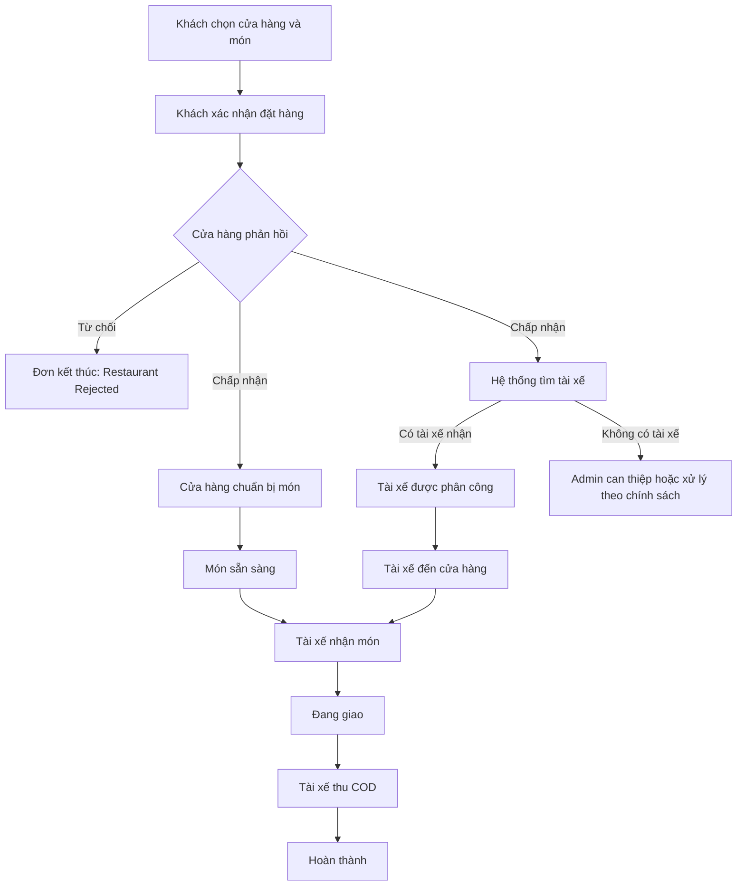
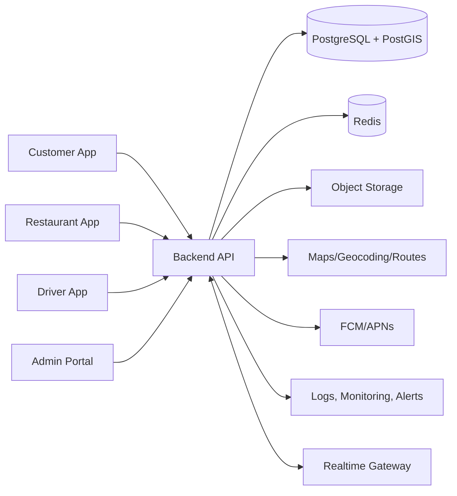

# ĐỀ XUẤT PHÁT TRIỂN NỀN TẢNG GIAO ĐỒ ĂN

## Project Proposal, Scope of Work & Preliminary Estimation

| Thông tin | Nội dung |
|---|---|
| Khách hàng | ______________________________________________ |
| Đơn vị đề xuất | ______________________________________________ |
| Người phụ trách | ______________________________________________ |
| Mã tài liệu | PRO-FDP-001 |
| Phiên bản | 2.0 |
| Trạng thái | Dự thảo xác nhận phạm vi |
| Ngày phát hành | 29/07/2026 |
| Thời hạn hiệu lực báo giá | Sẽ xác định sau khi hoàn tất SRQ |

---

## Kiểm soát tài liệu

### Lịch sử thay đổi

| Phiên bản | Ngày | Nội dung | Người thực hiện |
|---|---|---|---|
| 1.0 | 29/07/2026 | Bản proposal sơ bộ | |
| 2.0 | 29/07/2026 | Bổ sung phạm vi chi tiết, catalog màn hình, quy tắc nghiệp vụ, estimate và điều khoản | |

### Trạng thái yêu cầu trong tài liệu

| Nhãn | Ý nghĩa |
|---|---|
| **Bao gồm MVP** | Thuộc phạm vi cơ sở để estimate |
| **Cần xác nhận** | Chưa có câu trả lời chính thức từ khách hàng; có thể ảnh hưởng phạm vi |
| **Tùy chọn** | Chỉ triển khai khi được chọn và báo giá bổ sung |
| **Ngoài phạm vi** | Không thuộc MVP hiện tại |

> **Quan trọng:** Tài liệu này là bản đề xuất chi tiết dựa trên các trao đổi ban đầu. Những nội dung mang nhãn **Cần xác nhận** phải được hoàn tất trong `SRQ.md` và biên bản xác nhận phạm vi trước khi ký hợp đồng hoặc phát hành báo giá cố định.

---

# 1. TÓM TẮT ĐỀ XUẤT

## 1.1 Bối cảnh

Doanh nghiệp có nhu cầu xây dựng một nền tảng giao đồ ăn tập trung để kết nối bốn nhóm người dùng:

1. Khách hàng đặt món.
2. Cửa hàng tiếp nhận và chuẩn bị món.
3. Tài xế nhận đơn, giao hàng và thu tiền.
4. Nhân viên quản trị theo dõi và điều phối toàn bộ hoạt động.

Nền tảng hướng đến việc thay thế hoặc giảm phụ thuộc vào các quy trình thủ công như nhận đơn qua điện thoại/Zalo, gọi tài xế riêng lẻ, cập nhật trạng thái bằng tin nhắn và đối soát bằng bảng tính.

## 1.2 Giải pháp đề xuất

Giải pháp cơ sở gồm:

- **Customer App:** ứng dụng cho khách tìm cửa hàng, chọn món, đặt hàng và theo dõi đơn.
- **Restaurant App:** ứng dụng cho cửa hàng nhận đơn, xử lý món và quản lý thực đơn.
- **Driver App:** ứng dụng cho tài xế nhận đề nghị giao hàng, điều hướng, giao hàng và ghi nhận COD.
- **Admin Portal:** website cho vận hành, điều phối, quản lý dữ liệu, báo cáo và xử lý sự cố.
- **Backend Platform:** hệ thống API, dữ liệu, điều phối tài xế, realtime, thông báo, bản đồ và nhật ký hoạt động.

## 1.3 Giá trị mang lại

- Chuẩn hóa toàn bộ vòng đời đơn hàng từ lúc đặt đến khi hoàn thành.
- Giảm thời gian tìm và phân công tài xế.
- Minh bạch trạng thái đơn giữa khách, cửa hàng, tài xế và Admin.
- Giảm bỏ sót đơn, thao tác nhầm và tranh chấp trạng thái.
- Tạo dữ liệu tập trung phục vụ báo cáo, COD và mở rộng vận hành.
- Xây dựng nền tảng có thể bổ sung thanh toán online, voucher, nhiều chi nhánh hoặc ghép đơn trong giai đoạn sau.

## 1.4 Nguyên tắc của MVP

Phiên bản MVP ưu tiên:

- Quy trình đơn giản, dễ đào tạo và dễ vận hành.
- Có phương án Admin can thiệp khi tự động hóa thất bại.
- Không đưa các tính năng thương mại phức tạp vào khi nghiệp vụ chưa được xác nhận.
- Ghi nhật ký đầy đủ cho các hành động quan trọng.
- Thiết kế đủ khả năng mở rộng nhưng không xây dựng quá mức cần thiết.

---

# 2. MỤC TIÊU DỰ ÁN

## 2.1 Mục tiêu kinh doanh

- Tạo kênh đặt món trực tiếp thuộc sở hữu của doanh nghiệp.
- Tăng khả năng tiếp cận và phục vụ khách hàng trong khu vực mục tiêu.
- Kết nối nhiều cửa hàng và tài xế trên một quy trình thống nhất.
- Giảm chi phí và thời gian điều phối thủ công.
- Tạo cơ sở dữ liệu để đánh giá hiệu quả vận hành.

## 2.2 Mục tiêu vận hành

- Mỗi đơn có người chịu trách nhiệm rõ ràng tại từng thời điểm.
- Cửa hàng nhận được cảnh báo đơn mới và phản hồi trong thời gian quy định.
- Tài xế chỉ nhận được đơn phù hợp với trạng thái và khu vực hoạt động.
- Admin có thể theo dõi, đổi tài xế, hủy đơn có lý do và xem lịch sử xử lý.
- Khách nhận được trạng thái chính xác mà không phải gọi hỏi nhiều lần.

## 2.3 Mục tiêu kỹ thuật

- Dữ liệu đơn hàng được lưu tập trung, có lịch sử thay đổi và khả năng sao lưu.
- Các thao tác nhận đơn và phân công tài xế không tạo ra tình trạng một đơn được giao cho hai người.
- Hỗ trợ cập nhật trạng thái gần thời gian thực.
- Theo dõi vị trí chỉ trong phạm vi cần thiết cho vận hành và quyền riêng tư.
- Có giám sát lỗi, nhật ký hệ thống và công cụ hỗ trợ xử lý sự cố.

## 2.4 Chỉ số thành công cần xác nhận

| Chỉ số | Mục tiêu dự kiến | Trạng thái |
|---|---:|---|
| Cửa hàng tham gia giai đoạn đầu | Theo câu trả lời SRQ Q16 | **Cần xác nhận** |
| Tài xế online đồng thời | Theo câu trả lời SRQ Q16 | **Cần xác nhận** |
| Đơn trung bình/ngày | Theo câu trả lời SRQ Q16 | **Cần xác nhận** |
| Tỷ lệ đơn hoàn thành | Theo mục tiêu kinh doanh | **Cần xác nhận** |
| Thời gian phản hồi của cửa hàng | Theo SRQ Q31 | **Cần xác nhận** |
| Thời gian tìm được tài xế | Theo SRQ Q42, Q49–Q51 | **Cần xác nhận** |

---

# 3. PHẠM VI CƠ SỞ VÀ GIẢ ĐỊNH

## 3.1 Các giả định đã có từ trao đổi ban đầu

| Mã | Giả định | Tham chiếu SRQ | Ảnh hưởng nếu thay đổi |
|---|---|---|---|
| AS-01 | Hệ thống gồm 3 ứng dụng mobile và 1 Web Admin | Q01 | Thay đổi số kênh làm thay đổi UI, kiểm thử và phát hành |
| AS-02 | Một cửa hàng có một địa chỉ trong MVP | Q02 | Nhiều chi nhánh cần phân quyền, định tuyến và báo cáo riêng |
| AS-03 | Một đơn chỉ thuộc một cửa hàng | Q03 | Nhiều cửa hàng làm thay đổi giỏ hàng, thanh toán và điều phối |
| AS-04 | Một tài xế chỉ xử lý một đơn tại một thời điểm | Q04 | Ghép đơn cần thuật toán tối ưu và UI tuyến giao phức tạp |
| AS-05 | MVP sử dụng COD; chưa tích hợp cổng thanh toán | Q05 | Thanh toán online cần merchant, webhook, hoàn tiền và đối soát |
| AS-06 | Hệ thống tự tìm tài xế; Admin có thể can thiệp | Q06 | Chỉ thủ công hoặc broadcast toàn bộ sẽ thay đổi dispatch |
| AS-07 | Khách không tự hủy sau khi cửa hàng chấp nhận | Q07 | Cần ma trận hủy, phí hủy và phê duyệt nếu thay đổi |
| AS-08 | Ngôn ngữ mặc định là tiếng Việt | Q71 | Đa ngôn ngữ làm tăng nội dung và kiểm thử |
| AS-09 | Estimate cơ sở giả định Flutter cho 3 mobile app | Q69 | Làm riêng SwiftUI và Kotlin cần estimate lại đáng kể |

## 3.2 Các quyết định bắt buộc trước khi chốt báo giá

- Thiết bị/nền tảng của từng nhóm người dùng — SRQ Q69.
- Cửa hàng hay Admin quản lý thực đơn — SRQ Q32.
- Cách tính phí giao hàng — SRQ Q55.
- Quy trình COD, công nợ và đối soát — SRQ Q57–Q61.
- Phương thức gửi đề nghị cho tài xế — SRQ Q49.
- Thời gian chờ cửa hàng và tài xế — SRQ Q31, Q50.
- Bằng chứng giao hàng — SRQ Q44.
- Vai trò và quyền Admin — SRQ Q62–Q64.
- Quy mô và giờ vận hành — SRQ Q16–Q18.
- Yêu cầu thương hiệu/UI/UX — SRQ Q70.

## 3.3 Phạm vi bao gồm trong MVP

- Xác thực người dùng cơ bản.
- Quản lý cửa hàng, danh mục và món ăn.
- Giỏ hàng một cửa hàng.
- Tạo và theo dõi đơn hàng.
- Cửa hàng chấp nhận/từ chối và cập nhật chuẩn bị món.
- Tài xế online/offline, nhận đơn và cập nhật giao hàng.
- Điều phối tài xế tự động với khả năng Admin chỉ định.
- Theo dõi vị trí tài xế trong đơn đang hoạt động.
- Push notification cho các sự kiện chính.
- Ghi nhận số tiền COD và trạng thái đối soát cơ bản.
- Web Admin quản lý người dùng, đơn, tài xế, cửa hàng và báo cáo cơ bản.
- Triển khai môi trường production, backup cơ bản và hỗ trợ phát hành ứng dụng.

## 3.4 Hạng mục tùy chọn cần báo giá riêng

- Nhiều tài khoản/role nâng cao cho từng cửa hàng.
- In phiếu bếp hoặc tích hợp máy in.
- Đối soát COD và kế toán nâng cao.
- Quản lý banner/nội dung marketing.
- Báo cáo phân tích nâng cao.
- Chat trực tiếp trong ứng dụng.
- Đánh giá cửa hàng/tài xế.
- Website đặt món cho khách.
- Tích hợp POS, hóa đơn điện tử hoặc phần mềm kế toán.

## 3.5 Hạng mục ngoài phạm vi MVP

- Thanh toán trực tuyến và hoàn tiền tự động.
- Voucher, coupon, điểm thưởng và loyalty.
- Một đơn từ nhiều cửa hàng.
- Một tài xế giao nhiều đơn cùng lúc.
- Ví tài xế hoặc ví khách hàng.
- Tối ưu tuyến giao nhiều điểm.
- Marketplace quảng cáo trả phí.
- Call center tích hợp tổng đài.
- Hệ thống BI/Data Warehouse.
- Vận hành, nhập liệu và chăm sóc khách hàng thay cho doanh nghiệp.

---

# 4. NHÓM NGƯỜI DÙNG VÀ QUYỀN HẠN

| Nhóm | Mục đích | Quyền cơ sở |
|---|---|---|
| Customer | Tìm món, đặt hàng, theo dõi đơn | Quản lý dữ liệu cá nhân và đơn của chính mình |
| Restaurant Staff | Nhận và xử lý đơn | Chỉ xem dữ liệu của cửa hàng được phân công |
| Driver | Nhận và giao đơn | Chỉ xem đề nghị/đơn được giao cho mình |
| Super Admin | Quản trị toàn hệ thống | Toàn quyền cấu hình và xem dữ liệu |
| Operator | Điều phối vận hành | Xem đơn, gán/đổi tài xế, xử lý sự cố |
| Support | Chăm sóc khách hàng | Xem dữ liệu cần thiết, ghi nhận khiếu nại |
| Accounting | Đối soát COD | Xem báo cáo tiền và xác nhận đối soát |

> **Cần xác nhận:** MVP có thể gộp các role Admin thành một role để giảm phạm vi. Nếu tách nhiều role, cần ma trận quyền chi tiết và kiểm thử riêng.

---

# 5. LUỒNG NGHIỆP VỤ VÀ TRẠNG THÁI ĐƠN

## 5.1 Luồng tổng thể



## 5.2 Trạng thái đơn hàng

| Trạng thái | Ý nghĩa | Người cập nhật |
|---|---|---|
| `PENDING_RESTAURANT` | Đơn mới, chờ cửa hàng phản hồi | Hệ thống |
| `RESTAURANT_REJECTED` | Cửa hàng từ chối đơn và có lý do | Cửa hàng/Admin |
| `CONFIRMED` | Cửa hàng đã chấp nhận | Cửa hàng |
| `PREPARING` | Cửa hàng đang chuẩn bị món | Cửa hàng |
| `READY_FOR_PICKUP` | Món đã sẵn sàng để bàn giao | Cửa hàng |
| `PICKED_UP` | Tài xế đã nhận món | Tài xế |
| `DELIVERING` | Tài xế đang đi giao | Tài xế/Hệ thống |
| `COMPLETED` | Đã giao và ghi nhận tiền COD | Tài xế/Admin |
| `CANCELLED` | Đơn bị hủy theo chính sách | Khách/Cửa hàng/Admin/Hệ thống |
| `DELIVERY_FAILED` | Không giao được sau khi xử lý ngoại lệ | Tài xế/Admin |

## 5.3 Trạng thái điều phối tài xế

Trạng thái điều phối được tách khỏi trạng thái chuẩn bị món để hai quy trình có thể chạy song song.

| Trạng thái | Ý nghĩa |
|---|---|
| `NOT_STARTED` | Chưa bắt đầu tìm tài xế |
| `SEARCHING` | Đang chọn danh sách tài xế phù hợp |
| `OFFERED` | Đã gửi đề nghị và đang chờ phản hồi |
| `ASSIGNED` | Một tài xế đã nhận và được khóa đơn |
| `REASSIGN_REQUIRED` | Cần đổi tài xế do từ chối, timeout hoặc sự cố |
| `NO_DRIVER_AVAILABLE` | Không tìm được tài xế theo chính sách |

## 5.4 Trạng thái COD/đối soát

| Trạng thái | Ý nghĩa |
|---|---|
| `NOT_COLLECTED` | Chưa thu tiền từ khách |
| `COLLECTED` | Tài xế xác nhận đã thu |
| `SETTLEMENT_PENDING` | Đang chờ nộp/đối soát |
| `SETTLED` | Đã xác nhận đối soát |
| `DISPUTED` | Có chênh lệch hoặc tranh chấp |

> Quy trình chuyển giữa các trạng thái COD phụ thuộc câu trả lời SRQ Q57–Q61.

## 5.5 Ma trận hủy và ngoại lệ

| Tình huống | Hành động cơ sở | Ghi chú |
|---|---|---|
| Khách hủy trước khi cửa hàng chấp nhận | Cho phép hủy | **Bao gồm MVP** |
| Khách muốn hủy sau khi cửa hàng chấp nhận | Chuyển Admin xử lý | Không tự động cho phép |
| Cửa hàng từ chối trước khi chấp nhận | Kết thúc đơn và thông báo khách | Bắt buộc chọn lý do |
| Cửa hàng đã chấp nhận nhưng phát hiện hết món | Liên hệ khách/Admin | Cần chính sách đổi món hoặc hủy |
| Không tìm được tài xế | Retry, mở rộng phạm vi hoặc Admin can thiệp | Theo SRQ Q42 |
| Tài xế nhận nhưng không di chuyển | Nhắc nhở và cảnh báo Admin | Theo SRQ Q53 |
| Khách không nghe máy | Tài xế thực hiện quy trình liên hệ | Theo SRQ Q43 |
| Giao thất bại | Ghi lý do, bằng chứng và công nợ | Không dùng khái niệm refund nếu chỉ COD |

---

# 6. KIẾN TRÚC GIẢI PHÁP ĐỀ XUẤT



## 6.1 Nguyên tắc kiến trúc

- Backend là nguồn dữ liệu chính; ứng dụng không tự quyết định trạng thái quan trọng.
- Mọi thao tác nhận đơn phải được xác nhận nguyên tử tại Backend.
- Push notification dùng để cảnh báo, không dùng làm bằng chứng duy nhất rằng một tài xế đã nhận đơn.
- Realtime chỉ tăng tốc cập nhật giao diện; ứng dụng vẫn phải tải lại trạng thái chính thức khi mở lại hoặc mất kết nối.
- Vị trí tài xế có thời gian hết hạn để tránh phân đơn theo dữ liệu cũ.
- Các hành động của Admin, cửa hàng và tài xế được ghi audit log.

---

# 7. CUSTOMER APP — PHẠM VI MÀN HÌNH CHI TIẾT

## 7.1 Mục tiêu

Customer App cho phép khách tìm cửa hàng, xem thực đơn, tạo đơn COD và theo dõi toàn bộ tiến trình giao hàng bằng quy trình ngắn, dễ hiểu.

## 7.2 Danh sách màn hình

| ID | Màn hình | Trạng thái |
|---|---|---|
| CUS-01 | Splash & khôi phục phiên đăng nhập | **Bao gồm MVP** |
| CUS-02 | Giới thiệu & xin quyền cần thiết | **Bao gồm MVP** |
| CUS-03 | Đăng nhập/OTP | **Bao gồm MVP** |
| CUS-04 | Trang chủ | **Bao gồm MVP** |
| CUS-05 | Chọn/thêm địa chỉ giao hàng | **Bao gồm MVP** |
| CUS-06 | Danh sách cửa hàng | **Bao gồm MVP** |
| CUS-07 | Tìm kiếm cửa hàng và món | **Bao gồm MVP** |
| CUS-08 | Chi tiết cửa hàng & thực đơn | **Bao gồm MVP** |
| CUS-09 | Chi tiết món và tùy chọn | **Bao gồm MVP** |
| CUS-10 | Giỏ hàng | **Bao gồm MVP** |
| CUS-11 | Xác nhận đặt hàng/Checkout | **Bao gồm MVP** |
| CUS-12 | Đặt hàng thành công | **Bao gồm MVP** |
| CUS-13 | Đơn đang hoạt động | **Bao gồm MVP** |
| CUS-14 | Theo dõi giao hàng trên bản đồ | **Bao gồm MVP** |
| CUS-15 | Yêu cầu hủy đơn | **Bao gồm MVP có giới hạn** |
| CUS-16 | Lịch sử đơn | **Bao gồm MVP** |
| CUS-17 | Chi tiết đơn/biên nhận | **Bao gồm MVP** |
| CUS-18 | Trung tâm thông báo | **Bao gồm MVP** |
| CUS-19 | Hồ sơ cá nhân | **Bao gồm MVP** |
| CUS-20 | Sổ địa chỉ | **Cần xác nhận Q22** |
| CUS-21 | Trợ giúp/liên hệ hỗ trợ | **Bao gồm MVP cơ bản** |
| CUS-22 | Cài đặt, điều khoản và quyền riêng tư | **Bao gồm MVP** |

## 7.3 Đặc tả từng màn hình

### CUS-01 — Splash & khôi phục phiên đăng nhập

**Mục đích**

- Hiển thị nhận diện thương hiệu khi ứng dụng khởi động.
- Kiểm tra phiên đăng nhập, cấu hình ứng dụng và trạng thái bảo trì.

**Thành phần chính**

- Logo/tên thương hiệu.
- Chỉ báo đang tải.
- Thông báo bảo trì hoặc yêu cầu cập nhật phiên bản khi có cấu hình tương ứng.

**Hành động hệ thống**

- Nếu phiên còn hợp lệ, chuyển đến Trang chủ.
- Nếu chưa đăng nhập hoặc phiên hết hạn, chuyển đến Đăng nhập.
- Nếu người dùng đang có đơn hoạt động, hiển thị lối tắt đến đơn sau khi vào Trang chủ.

**Quy tắc và ngoại lệ**

- Không giữ người dùng tại Splash lâu hơn cần thiết.
- Khi mất mạng, cho phép thử lại và hiển thị thông báo dễ hiểu.
- Không làm mất giỏ hàng cục bộ chỉ vì phiên đăng nhập hết hạn.

### CUS-02 — Giới thiệu & xin quyền cần thiết

**Mục đích**

- Giải thích ngắn gọn giá trị của ứng dụng và lý do cần quyền vị trí/thông báo.

**Thành phần chính**

- 2–3 trang giới thiệu ngắn.
- Nút tiếp tục/bỏ qua.
- Giải thích quyền vị trí và push notification.

**Hành động**

- Xin quyền thông báo tại thời điểm phù hợp.
- Xin quyền vị trí khi người dùng chọn “Dùng vị trí hiện tại”, không bắt buộc ngay lúc mở app nếu chưa cần.

**Quy tắc và ngoại lệ**

- Người dùng từ chối quyền vị trí vẫn có thể nhập địa chỉ thủ công.
- Có hướng dẫn mở Settings khi quyền bị từ chối vĩnh viễn.

### CUS-03 — Đăng nhập/OTP

**Mục đích**

- Xác minh số điện thoại và tạo/khôi phục tài khoản khách.

**Thành phần chính**

- Nhập số điện thoại.
- Chọn mã quốc gia nếu cần.
- Nhập mã OTP.
- Bộ đếm thời gian gửi lại.
- Điều khoản sử dụng và chính sách bảo mật.

**Hành động**

- Gửi OTP, xác nhận OTP, gửi lại mã.
- Tự nhận diện mã OTP khi hệ điều hành hỗ trợ.

**Quy tắc và validation**

- Chuẩn hóa định dạng số điện thoại Việt Nam.
- Giới hạn số lần gửi/nhập sai để chống lạm dụng.
- Mã hết hạn phải có thông báo rõ và cho phép xin mã mới.

**Ngoại lệ**

- Dịch vụ SMS lỗi hoặc chậm.
- Tài khoản bị khóa cần hiển thị kênh hỗ trợ.

### CUS-04 — Trang chủ

**Mục đích**

- Là điểm bắt đầu để chọn địa chỉ, tìm cửa hàng và quay lại đơn đang hoạt động.

**Thành phần chính**

- Địa chỉ giao hàng hiện tại.
- Thanh tìm kiếm.
- Danh mục món/cửa hàng.
- Cửa hàng đang mở, gần khách hoặc nổi bật.
- Banner vận hành cơ bản nếu được cấu hình.
- Thẻ đơn đang hoạt động.

**Hành động**

- Đổi địa chỉ.
- Mở danh sách/tìm kiếm/chi tiết cửa hàng.
- Mở đơn đang giao.
- Làm mới dữ liệu.

**Quy tắc**

- Chỉ hiển thị cửa hàng có thể phục vụ địa chỉ hiện tại.
- Cửa hàng đóng cửa phải có nhãn rõ và không cho checkout giao ngay.
- Dữ liệu lỗi từng phần không được làm toàn bộ Trang chủ trắng.

### CUS-05 — Chọn/thêm địa chỉ giao hàng

**Mục đích**

- Thu thập địa chỉ đủ chính xác để tính phạm vi phục vụ và giao hàng.

**Thành phần chính**

- Tìm kiếm địa chỉ.
- Bản đồ và ghim vị trí.
- Dùng vị trí hiện tại.
- Địa chỉ văn bản, số nhà/đường, xã/phường.
- Ghi chú chỉ đường và tên người nhận.

**Hành động**

- Chọn kết quả tìm kiếm, kéo ghim, lưu địa chỉ.
- Chọn địa chỉ đã lưu nếu phạm vi Q22 được xác nhận.

**Quy tắc và validation**

- Phải có tọa độ và mô tả đủ để tài xế tìm được.
- Cảnh báo nếu ngoài khu vực phục vụ.
- Khi đổi địa chỉ trong lúc có giỏ hàng, kiểm tra cửa hàng còn phục vụ khu vực mới hay không.

### CUS-06 — Danh sách cửa hàng

**Mục đích**

- Cho khách duyệt các cửa hàng phù hợp với địa chỉ giao.

**Thành phần chính**

- Ảnh, tên, trạng thái mở cửa.
- Khoảng cách và thời gian giao dự kiến nếu có.
- Phí giao dự kiến hoặc nhãn “tính khi checkout”.
- Danh mục và bộ lọc cơ bản.

**Hành động**

- Cuộn tải thêm, lọc, làm mới, mở chi tiết cửa hàng.

**Quy tắc và ngoại lệ**

- Không hiển thị cửa hàng bị khóa hoặc ngoài vùng phục vụ.
- Cửa hàng tạm dừng nhận đơn vẫn có thể hiển thị nhưng phải khóa thao tác đặt.
- Có trạng thái rỗng khi chưa có cửa hàng phù hợp.

### CUS-07 — Tìm kiếm cửa hàng và món

**Mục đích**

- Giúp khách tìm nhanh theo tên cửa hàng hoặc tên món.

**Thành phần chính**

- Ô nhập từ khóa.
- Lịch sử tìm gần đây trên thiết bị.
- Kết quả chia nhóm Cửa hàng/Món ăn.
- Trạng thái không có kết quả.

**Hành động**

- Nhập/xóa từ khóa, chọn kết quả, xóa lịch sử.

**Quy tắc**

- Chỉ trả kết quả có thể phục vụ địa chỉ hiện tại.
- Có trì hoãn tìm kiếm hợp lý để không gửi yêu cầu cho từng ký tự.
- Nếu chọn món, mở đúng cửa hàng chứa món đó.

### CUS-08 — Chi tiết cửa hàng & thực đơn

**Mục đích**

- Cung cấp đầy đủ thông tin để khách chọn món từ một cửa hàng.

**Thành phần chính**

- Ảnh bìa/logo, tên và địa chỉ cửa hàng.
- Trạng thái mở cửa, thời gian chuẩn bị dự kiến.
- Phí giao/khoảng cách dự kiến.
- Danh mục món dạng tab/section.
- Danh sách món với ảnh, mô tả ngắn, giá và trạng thái hết món.
- Lối tắt đến giỏ hàng hiện tại.

**Hành động**

- Chọn danh mục, tìm trong cửa hàng, mở món, thêm nhanh món đơn giản.

**Quy tắc**

- Một giỏ hàng chỉ chứa món của một cửa hàng.
- Nếu khách chuyển cửa hàng khi giỏ đã có món, phải xác nhận xóa giỏ cũ.
- Không cho thêm món hết hàng hoặc ngoài giờ bán.

### CUS-09 — Chi tiết món và tùy chọn

**Mục đích**

- Cho khách cấu hình món trước khi thêm vào giỏ.

**Thành phần chính**

- Ảnh, tên, mô tả và giá cơ sở.
- Nhóm kích cỡ/phiên bản món.
- Nhóm topping/món thêm.
- Số lượng và ghi chú cho món.
- Giá tạm tính sau tùy chọn.

**Hành động**

- Chọn tùy chọn, tăng giảm số lượng, nhập ghi chú, thêm vào giỏ.

**Quy tắc và validation**

- Bắt buộc chọn đủ nhóm tùy chọn yêu cầu.
- Giới hạn số lựa chọn theo cấu hình.
- Giá hiển thị phải được Backend xác nhận lại khi checkout.
- Nếu món vừa hết hoặc đổi giá, thông báo và không âm thầm thay đổi.

### CUS-10 — Giỏ hàng

**Mục đích**

- Cho khách kiểm tra món đã chọn trước khi xác nhận giao hàng.

**Thành phần chính**

- Danh sách món, tùy chọn, ghi chú và số lượng.
- Tạm tính tiền món.
- Phí giao dự kiến.
- Tổng tiền dự kiến.
- Nút thêm món và tiếp tục checkout.

**Hành động**

- Tăng/giảm số lượng, sửa tùy chọn, xóa món, xóa giỏ.

**Quy tắc và ngoại lệ**

- Không cho số lượng nhỏ hơn 1; xóa cần xác nhận phù hợp.
- Tính lại giá khi mở giỏ hoặc khi checkout.
- Nếu cửa hàng đóng, tạm dừng hoặc món hết, hiển thị hướng xử lý cụ thể.

### CUS-11 — Xác nhận đặt hàng/Checkout

**Mục đích**

- Thu thập thông tin cuối cùng và hiển thị toàn bộ số tiền trước khi tạo đơn.

**Thành phần chính**

- Người nhận và số điện thoại.
- Địa chỉ và ghi chú giao hàng.
- Tóm tắt món.
- Ghi chú cho cửa hàng/tài xế.
- Phí món, phí giao và tổng COD.
- Hình thức thanh toán COD.
- Chính sách hủy đơn.

**Hành động**

- Sửa địa chỉ, sửa ghi chú, quay lại giỏ, xác nhận đặt hàng.

**Quy tắc và validation**

- Backend kiểm tra lại giá, trạng thái cửa hàng, vùng phục vụ và món còn bán.
- Nút đặt hàng chống bấm lặp; một yêu cầu không được tạo hai đơn.
- Mọi thay đổi giá phải được khách nhìn thấy và xác nhận lại.

**Ngoại lệ**

- Không đủ tài xế chưa phải lý do chặn tạo đơn nếu nghiệp vụ cho phép tìm sau.
- Nếu địa chỉ ngoài vùng phục vụ, không cho tiếp tục và hướng dẫn đổi địa chỉ.

### CUS-12 — Đặt hàng thành công

**Mục đích**

- Xác nhận hệ thống đã nhận đơn và giải thích bước tiếp theo.

**Thành phần chính**

- Mã đơn.
- Trạng thái “Chờ cửa hàng xác nhận”.
- Tổng COD dự kiến.
- Thời gian chờ dự kiến.
- Nút theo dõi đơn và về Trang chủ.

**Quy tắc**

- Chỉ hiển thị thành công khi Backend đã tạo đơn.
- Nếu phản hồi mạng không rõ ràng, ứng dụng phải kiểm tra lịch sử trước khi cho đặt lại.

### CUS-13 — Đơn đang hoạt động

**Mục đích**

- Hiển thị tiến trình đơn một cách dễ hiểu ở mọi giai đoạn.

**Thành phần chính**

- Mã đơn và tên cửa hàng.
- Timeline trạng thái.
- Thời gian dự kiến.
- Tóm tắt món và tổng COD.
- Thông tin tài xế khi đã phân công.
- Các hành động hợp lệ theo trạng thái.

**Hành động**

- Làm mới, mở bản đồ, gọi cửa hàng/tài xế, yêu cầu hủy, liên hệ hỗ trợ.

**Quy tắc**

- Trạng thái hiển thị phải lấy từ Backend.
- Không hiển thị nút hủy khi trạng thái không cho phép.
- Khi mất realtime, tự đồng bộ lại bằng API.

### CUS-14 — Theo dõi giao hàng trên bản đồ

**Mục đích**

- Cho khách theo dõi tài xế sau khi đơn bước vào giai đoạn phù hợp.

**Thành phần chính**

- Vị trí cửa hàng, khách và tài xế.
- Tuyến đường tham khảo.
- Thời gian đến dự kiến.
- Thông tin tài xế và nút gọi.
- Trạng thái cập nhật vị trí.

**Quy tắc và ngoại lệ**

- Chỉ hiển thị vị trí khi tài xế đang thực hiện đơn của khách.
- Không giả vờ realtime khi vị trí đã cũ; hiển thị “cập nhật lần cuối”.
- Khi tài xế tắt GPS/mất mạng, vẫn giữ trạng thái đơn và thông báo phù hợp.
- Tần suất cập nhật được tối ưu theo trạng thái để tránh hao pin.

### CUS-15 — Yêu cầu hủy đơn

**Mục đích**

- Cho khách hủy trong phạm vi được phép và ghi nhận lý do.

**Thành phần chính**

- Chính sách hủy theo trạng thái hiện tại.
- Danh sách lý do.
- Xác nhận cuối cùng.
- Thông báo chuyển hỗ trợ nếu không còn quyền tự hủy.

**Quy tắc**

- Trước khi cửa hàng chấp nhận: khách có thể tự hủy.
- Sau khi cửa hàng chấp nhận: mặc định chuyển yêu cầu đến Admin, không tự động hủy.
- Mọi lần hủy phải có người thực hiện, lý do và thời điểm.

### CUS-16 — Lịch sử đơn

**Mục đích**

- Cho khách xem lại các đơn trước đây.

**Thành phần chính**

- Danh sách theo thời gian.
- Trạng thái cuối, cửa hàng, tổng tiền và ngày đặt.
- Bộ lọc cơ bản theo trạng thái nếu cần.

**Hành động**

- Mở chi tiết đơn, tải thêm dữ liệu.
- “Đặt lại” chỉ là **Tùy chọn**, vì giá và thực đơn có thể đã thay đổi.

**Quy tắc**

- Khách chỉ xem được các đơn thuộc tài khoản của mình.
- Danh sách dùng phân trang và không tải toàn bộ lịch sử trong một lần.
- Đơn đã hủy hoặc giao thất bại vẫn được giữ để tra cứu theo chính sách lưu dữ liệu.

### CUS-17 — Chi tiết đơn/biên nhận

**Mục đích**

- Hiển thị ảnh chụp đầy đủ của đơn tại thời điểm đặt.

**Thành phần chính**

- Mã đơn, thời gian và trạng thái cuối.
- Thông tin cửa hàng, tài xế và địa chỉ giao.
- Danh sách món với giá đã chốt.
- Phí giao, tổng COD và trạng thái thu tiền.
- Timeline các sự kiện chính.
- Lý do hủy/giao thất bại nếu có.

**Quy tắc**

- Dùng dữ liệu snapshot của đơn, không dùng giá hiện tại của món.
- Không hiển thị dữ liệu nhạy cảm của tài xế sau thời gian cần thiết.

### CUS-18 — Trung tâm thông báo

**Mục đích**

- Lưu các thông báo liên quan đến đơn để khách có thể xem lại.

**Thành phần chính**

- Danh sách thông báo, trạng thái đã đọc/chưa đọc.
- Thời gian và loại sự kiện.
- Deep link đến đơn tương ứng.

**Quy tắc**

- Push và bản ghi trong ứng dụng phải tham chiếu cùng một sự kiện.
- Nếu đơn không còn truy cập được, thông báo không được dẫn đến màn hình lỗi trắng.

### CUS-19 — Hồ sơ cá nhân

**Mục đích**

- Cho khách xem và cập nhật thông tin cơ bản.

**Thành phần chính**

- Họ tên, số điện thoại, ảnh đại diện tùy chọn.
- Lối tắt đến địa chỉ, lịch sử và hỗ trợ.

**Quy tắc**

- Đổi số điện thoại cần xác minh lại.
- Các trường bắt buộc phải được chuẩn hóa và kiểm tra độ dài.

### CUS-20 — Sổ địa chỉ

**Mục đích**

- Lưu và quản lý nhiều địa chỉ giao hàng nếu SRQ Q22 được chọn.

**Thành phần chính**

- Danh sách địa chỉ Nhà/Công ty/Khác.
- Địa chỉ mặc định.
- Thêm, sửa, xóa địa chỉ.

**Quy tắc**

- Không xóa địa chỉ đang được dùng bởi đơn hoạt động.
- Xóa địa chỉ không làm thay đổi thông tin snapshot của đơn cũ.

### CUS-21 — Trợ giúp/liên hệ hỗ trợ

**Mục đích**

- Cung cấp lối xử lý nhanh khi khách gặp vấn đề.

**Thành phần chính**

- Hotline/Zalo/Email theo lựa chọn SRQ Q68.
- Danh sách vấn đề thường gặp.
- Gửi yêu cầu hỗ trợ kèm mã đơn.

**Quy tắc**

- Không xây chat realtime trong MVP.
- Yêu cầu hỗ trợ phải ghi mã đơn và thông tin liên hệ nếu có liên quan.

### CUS-22 — Cài đặt, điều khoản và quyền riêng tư

**Mục đích**

- Cho khách quản lý tùy chọn ứng dụng và xem tài liệu pháp lý.

**Thành phần chính**

- Bật/tắt nhóm thông báo không bắt buộc.
- Ngôn ngữ nếu có nhiều ngôn ngữ.
- Điều khoản sử dụng, chính sách bảo mật.
- Phiên bản ứng dụng.
- Đăng xuất và yêu cầu xóa tài khoản/dữ liệu theo chính sách.

**Quy tắc**

- Không cho tắt các thông báo vận hành quan trọng bên trong ứng dụng.
- Luồng xóa tài khoản phải cảnh báo ảnh hưởng và xử lý dữ liệu theo chính sách đã công bố.

# 8. RESTAURANT APP — PHẠM VI MÀN HÌNH CHI TIẾT

## 8.1 Mục tiêu

Restaurant App giúp cửa hàng phản hồi đơn mới nhanh, cập nhật tiến độ chuẩn bị món, bàn giao đúng đơn cho tài xế và duy trì thực đơn trong phạm vi quyền được cấp.

## 8.2 Danh sách màn hình

| ID | Màn hình | Trạng thái |
|---|---|---|
| RES-01 | Splash & khôi phục phiên | **Bao gồm MVP** |
| RES-02 | Đăng nhập | **Bao gồm MVP** |
| RES-03 | Thiết lập ban đầu & quyền thông báo | **Bao gồm MVP** |
| RES-04 | Dashboard & trạng thái cửa hàng | **Bao gồm MVP** |
| RES-05 | Cảnh báo đơn mới | **Bao gồm MVP** |
| RES-06 | Chi tiết đơn mới — chấp nhận/từ chối | **Bao gồm MVP** |
| RES-07 | Hàng đợi chuẩn bị món | **Bao gồm MVP** |
| RES-08 | Chi tiết đơn đang chuẩn bị | **Bao gồm MVP** |
| RES-09 | Món sẵn sàng & bàn giao tài xế | **Bao gồm MVP** |
| RES-10 | Theo dõi tài xế đến lấy món | **Cần xác nhận Q54** |
| RES-11 | Đơn đang hoạt động | **Bao gồm MVP** |
| RES-12 | Lịch sử đơn | **Bao gồm MVP** |
| RES-13 | Tổng quan thực đơn | **Bao gồm MVP nếu cửa hàng quản lý menu** |
| RES-14 | Quản lý danh mục món | **Cần xác nhận Q32–Q33** |
| RES-15 | Danh sách món & trạng thái bán | **Bao gồm MVP nếu cửa hàng quản lý menu** |
| RES-16 | Thêm/sửa món | **Cần xác nhận Q32–Q35** |
| RES-17 | Hồ sơ, giờ mở cửa & tạm dừng nhận đơn | **Bao gồm MVP** |
| RES-18 | Tài khoản nhân viên & phân quyền | **Tùy chọn** |
| RES-19 | Báo cáo cửa hàng & đối soát | **Cần xác nhận Q36, Q58–Q60** |
| RES-20 | Thông báo, hỗ trợ & cài đặt | **Bao gồm MVP cơ bản** |

## 8.3 Đặc tả từng màn hình

### RES-01 — Splash & khôi phục phiên

**Mục đích**

- Kiểm tra phiên đăng nhập và cửa hàng được gán cho tài khoản.
- Nạp cấu hình trạng thái cửa hàng trước khi vào Dashboard.

**Thành phần chính**

- Logo thương hiệu.
- Chỉ báo tải.
- Thông báo bảo trì/yêu cầu cập nhật.

**Quy tắc và ngoại lệ**

- Tài khoản không còn quyền tại cửa hàng phải bị chặn và hướng dẫn liên hệ Admin.
- Nếu cửa hàng bị tạm khóa, hiển thị lý do thay vì mở Dashboard bình thường.
- Khi mất mạng, cho phép thử lại; không tự chuyển cửa hàng sang trạng thái mở/đóng.

### RES-02 — Đăng nhập

**Mục đích**

- Xác thực chủ cửa hàng hoặc nhân viên được cấp quyền.

**Thành phần chính**

- Số điện thoại/Email hoặc tên đăng nhập theo cấu hình.
- Mật khẩu hoặc OTP.
- Quên mật khẩu/nhận lại mã.
- Điều khoản sử dụng dành cho đối tác cửa hàng.

**Quy tắc và validation**

- Giới hạn đăng nhập sai và ghi nhận thiết bị.
- Nếu một tài khoản thuộc nhiều cửa hàng/chi nhánh, cần màn hình chọn cửa hàng — **Tùy chọn**.
- Tài khoản bị khóa không được nhận dữ liệu đơn mới.

### RES-03 — Thiết lập ban đầu & quyền thông báo

**Mục đích**

- Đảm bảo thiết bị có thể nhận cảnh báo đơn mới và phát âm thanh phù hợp.

**Thành phần chính**

- Giải thích quyền thông báo.
- Kiểm tra âm lượng/cảnh báo thử.
- Hướng dẫn giữ kết nối và tắt chế độ tiết kiệm pin nếu ảnh hưởng.

**Hành động**

- Cho phép thông báo, gửi thông báo thử, mở cài đặt hệ thống.

**Quy tắc**

- Nếu cửa hàng từ chối quyền thông báo, Dashboard phải hiển thị cảnh báo liên tục cho đến khi xử lý.
- Push không thay thế việc Dashboard tự đồng bộ danh sách đơn khi ứng dụng mở lại.

### RES-04 — Dashboard & trạng thái cửa hàng

**Mục đích**

- Cung cấp tổng quan vận hành hiện tại và điều khiển khả năng nhận đơn.

**Thành phần chính**

- Trạng thái Mở cửa/Đóng cửa/Tạm dừng/Quá tải.
- Số đơn mới, đang chuẩn bị, chờ tài xế và hoàn thành hôm nay.
- Lối tắt đến hàng đợi đơn và thực đơn.
- Cảnh báo đơn quá thời gian phản hồi/chuẩn bị.
- Thông báo hệ thống quan trọng.

**Hành động**

- Mở/đóng hoặc tạm dừng nhận đơn theo quyền.
- Chọn thời gian tạm dừng hoặc thời gian chuẩn bị tăng thêm.
- Mở nhanh đơn cần xử lý.

**Quy tắc**

- Thay đổi trạng thái cửa hàng phải ghi người thực hiện và thời gian.
- Đóng cửa không tự hủy các đơn đã chấp nhận.
- Khi tạm dừng, khách phải nhìn thấy trạng thái mới trong thời gian hợp lý.

### RES-05 — Cảnh báo đơn mới

**Mục đích**

- Thu hút sự chú ý ngay khi có đơn chờ phản hồi.

**Thành phần chính**

- Mã đơn, thời điểm tạo và bộ đếm thời gian còn lại.
- Số món, tổng giá trị và khoảng cách giao tham khảo.
- Âm thanh/rung lặp lại theo cấu hình.
- Nút xem chi tiết.

**Quy tắc và ngoại lệ**

- Một đơn mới chỉ tạo một cảnh báo logic dù có nhiều push trùng.
- Nếu nhiều thiết bị cùng đăng nhập, khi một người phản hồi thì các thiết bị khác phải đồng bộ ngay.
- Hết thời gian phản hồi thực hiện chính sách SRQ Q31; không tự suy đoán.

### RES-06 — Chi tiết đơn mới — chấp nhận/từ chối

**Mục đích**

- Cho cửa hàng kiểm tra khả năng phục vụ trước khi cam kết chuẩn bị.

**Thành phần chính**

- Mã đơn và bộ đếm phản hồi.
- Danh sách món, tùy chọn, số lượng và ghi chú.
- Thông tin giao hàng cần thiết.
- Tổng tiền món và tổng COD dự kiến.
- Nút Chấp nhận/Từ chối.
- Thời gian chuẩn bị dự kiến.

**Hành động**

- Chấp nhận, chọn thời gian chuẩn bị.
- Từ chối và chọn lý do.
- Gọi khách hoặc liên hệ Admin nếu được phép.

**Quy tắc và validation**

- Chấp nhận là thao tác có xác nhận vì sau đó khách mặc định không được tự hủy.
- Từ chối bắt buộc chọn lý do; lý do được hiển thị phù hợp cho khách/Admin.
- Hai nhân viên thao tác đồng thời chỉ một kết quả được Backend chấp nhận.

### RES-07 — Hàng đợi chuẩn bị món

**Mục đích**

- Sắp xếp các đơn cần bếp xử lý theo mức độ ưu tiên.

**Thành phần chính**

- Nhóm đơn Mới xác nhận/Đang chuẩn bị/Sắp trễ/Đã sẵn sàng.
- Mã đơn, thời gian nhận, số món và giờ dự kiến hoàn thành.
- Chỉ báo tài xế đã được phân công/đang đến.
- Bộ lọc trạng thái cơ bản.

**Hành động**

- Mở chi tiết, chuyển trạng thái hợp lệ, đánh dấu ưu tiên nội bộ nếu có.

**Quy tắc**

- Mặc định sắp xếp theo thời gian cam kết và cảnh báo đơn sắp trễ.
- Không cho nhảy trực tiếp từ xác nhận sang hoàn thành giao hàng.
- Thay đổi từ thiết bị khác phải cập nhật gần realtime.

### RES-08 — Chi tiết đơn đang chuẩn bị

**Mục đích**

- Là màn hình làm việc chính khi cửa hàng chuẩn bị từng đơn.

**Thành phần chính**

- Danh sách món dạng dễ đọc cho bếp.
- Tùy chọn, topping và ghi chú nổi bật.
- Thời gian đã trôi qua và thời gian cam kết.
- Trạng thái điều phối tài xế.
- Nút “Bắt đầu chuẩn bị” và “Món đã sẵn sàng”.

**Hành động**

- Cập nhật tiến độ.
- Gọi khách/Admin khi phát hiện hết món hoặc cần thay đổi.
- Xem thông tin tài xế sau khi được phân công.

**Quy tắc và ngoại lệ**

- Không cho cửa hàng tự sửa giá/tổng đơn sau khi chấp nhận nếu chưa có quy trình phê duyệt.
- Hết món sau khi chấp nhận phải đi qua luồng ngoại lệ SRQ Q41.
- Mọi thay đổi ảnh hưởng khách phải được ghi log.

### RES-09 — Món sẵn sàng & bàn giao tài xế

**Mục đích**

- Xác nhận món đã hoàn tất và bàn giao đúng tài xế/đúng đơn.

**Thành phần chính**

- Mã đơn lớn, danh sách gói/món.
- Thông tin tài xế, ảnh, biển số và số điện thoại khi được phép.
- Trạng thái tài xế đang đến/đã đến.
- Mã bàn giao hoặc nút xác nhận giao món.

**Hành động**

- Đánh dấu sẵn sàng.
- Xác minh tài xế.
- Xác nhận bàn giao.
- Báo sự cố sai tài xế/không có tài xế.

**Quy tắc**

- Không cho xác nhận bàn giao khi chưa có tài xế được gán, trừ thao tác Admin đặc biệt.
- Tài xế phải đồng thời xác nhận đã nhận món hoặc dùng mã bàn giao nếu được chọn.
- Thời điểm bàn giao được ghi vào timeline đơn.

### RES-10 — Theo dõi tài xế đến lấy món

**Mục đích**

- Giúp cửa hàng dự đoán thời điểm tài xế đến để phối hợp chuẩn bị.

**Thành phần chính**

- Bản đồ nhỏ hoặc ETA.
- Vị trí cập nhật gần nhất.
- Thông tin và nút gọi tài xế.

**Quy tắc**

- Chỉ hiển thị khi SRQ Q54 xác nhận nhu cầu.
- Không hiển thị tài xế ngoài các đơn thuộc cửa hàng.
- Nếu vị trí cũ hoặc mất kết nối, hiển thị trạng thái thay vì ETA sai.

### RES-11 — Đơn đang hoạt động

**Mục đích**

- Cho cửa hàng theo dõi các đơn đã bàn giao nhưng chưa hoàn tất.

**Thành phần chính**

- Danh sách Đã lấy món/Đang giao/Giao thất bại/Chờ xử lý.
- Trạng thái tài xế, khách và COD ở mức phù hợp.
- Lối tắt liên hệ Admin.

**Quy tắc**

- Cửa hàng không tự thay đổi trạng thái giao hàng sau bàn giao.
- Có cảnh báo khi đơn giao thất bại hoặc được trả lại.

### RES-12 — Lịch sử đơn

**Mục đích**

- Tra cứu các đơn của riêng cửa hàng.

**Thành phần chính**

- Danh sách theo ngày và trạng thái.
- Tìm theo mã đơn/số điện thoại được che phù hợp.
- Bộ lọc Hoàn thành/Hủy/Từ chối/Giao thất bại.
- Tổng giá trị đơn trong khoảng lọc.

**Hành động**

- Mở chi tiết, tải thêm, xuất dữ liệu nếu phạm vi báo cáo được chọn.

**Quy tắc**

- Chỉ truy cập dữ liệu cửa hàng được phân quyền.
- Dữ liệu đơn cũ dùng snapshot món và giá tại thời điểm đặt.

### RES-13 — Tổng quan thực đơn

**Mục đích**

- Hiển thị cấu trúc thực đơn và vấn đề cần xử lý.

**Thành phần chính**

- Số danh mục, số món đang bán/hết món/ẩn.
- Lối tắt tạo danh mục, món mới.
- Cảnh báo món thiếu ảnh/giá/thông tin bắt buộc.

**Quy tắc**

- Chỉ bao gồm nếu cửa hàng có quyền quản lý menu theo SRQ Q32.
- Nếu Admin phê duyệt thay đổi, hiển thị trạng thái Chờ duyệt/Từ chối.

### RES-14 — Quản lý danh mục món

**Mục đích**

- Tạo và sắp xếp các nhóm món trong cửa hàng.

**Thành phần chính**

- Danh sách danh mục, thứ tự hiển thị và trạng thái.
- Thêm/sửa/ẩn danh mục.
- Kéo sắp xếp nếu thiết kế cho phép.

**Quy tắc**

- Không xóa cứng danh mục đang có món; dùng ẩn hoặc chuyển món trước.
- Tên danh mục không được trống và có giới hạn độ dài.

### RES-15 — Danh sách món & trạng thái bán

**Mục đích**

- Quản lý nhanh toàn bộ món và tình trạng bán trong ngày.

**Thành phần chính**

- Ảnh, tên, danh mục, giá và trạng thái.
- Tìm kiếm/lọc theo danh mục và tình trạng.
- Công tắc Còn món/Hết món/Ẩn.

**Hành động**

- Đổi trạng thái bán nhanh.
- Mở chỉnh sửa món.
- Tạo món mới nếu có quyền.

**Quy tắc**

- Thay đổi trạng thái phải đồng bộ với Customer App trong thời gian hợp lý.
- Món đã có trong đơn cũ không bị thay đổi khi sửa/xóa khỏi thực đơn.

### RES-16 — Thêm/sửa món

**Mục đích**

- Tạo hoặc cập nhật nội dung bán hàng của món.

**Thành phần chính**

- Tên, mô tả, ảnh, danh mục và giá.
- Kích cỡ/phiên bản món.
- Nhóm topping/món thêm và giới hạn lựa chọn.
- Giờ bán, trạng thái và món nổi bật nếu có.

**Hành động**

- Lưu nháp, gửi duyệt hoặc áp dụng ngay tùy mô hình quản trị.

**Quy tắc và validation**

- Giá phải lớn hơn hoặc bằng 0 và theo định dạng tiền tệ thống nhất.
- Ảnh phải đúng định dạng/kích thước cho phép.
- Tùy chọn bắt buộc phải có ít nhất một lựa chọn hợp lệ.
- Thay đổi giá không làm thay đổi đơn đã đặt.

### RES-17 — Hồ sơ, giờ mở cửa & tạm dừng nhận đơn

**Mục đích**

- Quản lý thông tin vận hành cơ bản của cửa hàng.

**Thành phần chính**

- Tên, ảnh, địa chỉ và liên hệ.
- Lịch mở cửa theo ngày.
- Khoảng nghỉ và ngày nghỉ đặc biệt.
- Thời gian chuẩn bị mặc định.
- Trạng thái tạm dừng nhận đơn.

**Quy tắc**

- Địa chỉ/tọa độ có thể chỉ Admin được sửa vì ảnh hưởng phí và điều phối.
- Thay đổi quan trọng có thể cần Admin phê duyệt.
- Tạm dừng nhận đơn không ảnh hưởng đơn đã xác nhận.

### RES-18 — Tài khoản nhân viên & phân quyền

**Mục đích**

- Cho chủ cửa hàng quản lý nhiều người dùng nếu phạm vi được chọn.

**Thành phần chính**

- Danh sách nhân viên.
- Mời/thêm/tạm khóa tài khoản.
- Role Chủ cửa hàng/Quản lý/Nhân viên nhận đơn/Quản lý menu.

**Quy tắc**

- Đây là hạng mục **Tùy chọn**; MVP cơ sở có thể dùng một tài khoản cửa hàng.
- Không cho người dùng tự nâng quyền cao hơn.
- Mọi thay đổi quyền được ghi audit log.

### RES-19 — Báo cáo cửa hàng & đối soát

**Mục đích**

- Cung cấp số liệu đơn hàng và tiền theo phạm vi khách hàng xác nhận.

**Thành phần chính**

- Số đơn hoàn thành/hủy/từ chối.
- Tổng giá trị món theo ngày/tháng.
- Phí/hoa hồng nếu có.
- Công nợ hoặc trạng thái đối soát.
- Xuất file nếu được chọn.

**Quy tắc**

- Công thức báo cáo phải khớp quy trình COD Q58–Q61.
- Mỗi số liệu cần có khả năng truy ngược về danh sách đơn.
- Không hiển thị doanh thu của cửa hàng khác.

### RES-20 — Thông báo, hỗ trợ & cài đặt

**Mục đích**

- Tập trung thông báo vận hành và kênh trợ giúp cho cửa hàng.

**Thành phần chính**

- Trung tâm thông báo đơn và hệ thống.
- Kiểm tra âm thanh cảnh báo.
- Hotline/Zalo/Email hỗ trợ.
- Đổi mật khẩu/đăng xuất.
- Điều khoản đối tác và phiên bản ứng dụng.

**Quy tắc**

- Không cho tắt hoàn toàn cảnh báo đơn mới khi cửa hàng đang ở trạng thái nhận đơn.
- Thông báo phải dẫn đến đúng đơn hoặc cấu hình liên quan.

# 9. DRIVER APP — PHẠM VI MÀN HÌNH CHI TIẾT

## 9.1 Mục tiêu

Driver App giúp tài xế quản lý trạng thái sẵn sàng, nhận đúng một đơn tại một thời điểm, di chuyển đến cửa hàng và khách, ghi nhận COD và cung cấp bằng chứng hoàn thành hoặc giao thất bại.

## 9.2 Danh sách màn hình

| ID | Màn hình | Trạng thái |
|---|---|---|
| DRV-01 | Splash & kiểm tra phiên | **Bao gồm MVP** |
| DRV-02 | Đăng nhập/OTP | **Bao gồm MVP** |
| DRV-03 | Đăng ký hồ sơ & trạng thái phê duyệt | **Cần xác nhận Q45–Q46** |
| DRV-04 | Thiết lập quyền vị trí/thông báo | **Bao gồm MVP** |
| DRV-05 | Trang chủ Online/Offline | **Bao gồm MVP** |
| DRV-06 | Đề nghị giao hàng | **Bao gồm MVP** |
| DRV-07 | Tóm tắt đơn được phân công | **Bao gồm MVP** |
| DRV-08 | Điều hướng đến cửa hàng | **Bao gồm MVP** |
| DRV-09 | Xác nhận đã đến cửa hàng | **Bao gồm MVP** |
| DRV-10 | Kiểm tra và nhận món | **Bao gồm MVP** |
| DRV-11 | Điều hướng đến khách | **Bao gồm MVP** |
| DRV-12 | Chi tiết giao hàng & liên hệ khách | **Bao gồm MVP** |
| DRV-13 | Xác nhận thu COD | **Bao gồm MVP** |
| DRV-14 | Bằng chứng và hoàn thành giao hàng | **Cần xác nhận Q44** |
| DRV-15 | Báo sự cố/giao thất bại | **Bao gồm MVP** |
| DRV-16 | Tổng quan đơn đang thực hiện | **Bao gồm MVP** |
| DRV-17 | Lịch sử đơn | **Bao gồm MVP** |
| DRV-18 | Thu nhập & sổ COD | **Cần xác nhận Q58–Q61** |
| DRV-19 | Hồ sơ, phương tiện & giấy tờ | **Cần xác nhận Q46** |
| DRV-20 | Thông báo, hỗ trợ & cài đặt | **Bao gồm MVP cơ bản** |

## 9.3 Đặc tả từng màn hình

### DRV-01 — Splash & kiểm tra phiên

**Mục đích**

- Kiểm tra phiên, trạng thái phê duyệt tài xế và đơn đang hoạt động.

**Hành động hệ thống**

- Nếu có đơn chưa hoàn thành, mở lại luồng đơn thay vì Trang chủ trống.
- Nếu tài khoản chờ duyệt/bị khóa, chuyển đúng màn hình trạng thái.
- Khôi phục trạng thái online chỉ khi quyền vị trí và chính sách vận hành cho phép.

**Quy tắc và ngoại lệ**

- Không được tạo hai phiên làm việc có thể cùng nhận đơn nếu chính sách chỉ cho một thiết bị.
- Mất mạng không được tự đánh dấu đơn hoàn thành hoặc tự bỏ phân công.

### DRV-02 — Đăng nhập/OTP

**Mục đích**

- Xác minh tài xế bằng số điện thoại hoặc tài khoản do Admin cấp.

**Thành phần chính**

- Số điện thoại, OTP hoặc mật khẩu.
- Gửi lại mã/Quên mật khẩu.
- Điều khoản tài xế và chính sách vị trí.

**Quy tắc và validation**

- Tài khoản chưa được duyệt không được chuyển Online.
- Tài khoản bị khóa phải hiển thị lý do và kênh hỗ trợ.
- Giới hạn số lần nhập sai và số lần gửi OTP.

### DRV-03 — Đăng ký hồ sơ & trạng thái phê duyệt

**Mục đích**

- Thu thập hồ sơ tài xế nếu mô hình cho phép tự đăng ký.

**Thành phần chính**

- Họ tên, ngày sinh, địa chỉ và số điện thoại.
- Ảnh đại diện.
- CCCD, giấy phép lái xe.
- Loại xe, biển số và ảnh phương tiện.
- Khu vực hoạt động.
- Tài khoản ngân hàng nếu cần đối soát.

**Trạng thái**

- Chưa gửi hồ sơ.
- Chờ phê duyệt.
- Cần bổ sung.
- Đã phê duyệt.
- Bị từ chối/tạm khóa.

**Quy tắc**

- Trường bắt buộc phụ thuộc SRQ Q46.
- Ảnh giấy tờ phải được bảo vệ và giới hạn người truy cập.
- Admin phải ghi lý do khi yêu cầu bổ sung hoặc từ chối.

### DRV-04 — Thiết lập quyền vị trí/thông báo

**Mục đích**

- Đảm bảo tài xế có thể nhận đề nghị và gửi vị trí khi hoạt động.

**Thành phần chính**

- Giải thích quyền vị trí khi dùng ứng dụng và vị trí nền.
- Giải thích quyền thông báo.
- Trạng thái GPS, kết nối và tối ưu pin.
- Nút mở Settings.

**Quy tắc**

- Không cho chuyển Online nếu thiếu quyền vị trí tối thiểu cần thiết.
- Chỉ theo dõi vị trí khi tài xế Online hoặc đang thực hiện đơn theo chính sách.
- Hiển thị rõ khi hệ thống đang sử dụng vị trí.

### DRV-05 — Trang chủ Online/Offline

**Mục đích**

- Là màn hình điều khiển ca làm việc của tài xế.

**Thành phần chính**

- Nút Online/Offline nổi bật.
- Trạng thái vị trí, mạng và thông báo.
- Khu vực hoạt động hiện tại.
- Số đơn/thu nhập tóm tắt trong ngày nếu phạm vi cho phép.
- Thẻ đơn đang thực hiện.
- Cảnh báo hồ sơ/giấy tờ sắp hết hạn nếu có.

**Hành động**

- Chuyển Online/Offline.
- Mở lịch sử, hồ sơ, hỗ trợ.

**Quy tắc**

- Không cho Offline bình thường khi đang có đơn; phải xử lý qua luồng sự cố.
- Online chỉ thành công sau khi Backend xác nhận và nhận được vị trí đủ mới.
- Tài xế bị khóa hoặc ngoài khu vực không được nhận đề nghị.

### DRV-06 — Đề nghị giao hàng

**Mục đích**

- Cung cấp đủ thông tin để tài xế quyết định nhận/từ chối trong thời gian giới hạn.

**Thành phần chính**

- Bộ đếm thời gian.
- Vị trí/tên cửa hàng.
- Khoảng cách đến cửa hàng và đến khách ở mức phù hợp.
- Tổng quãng đường/thu nhập dự kiến nếu nghiệp vụ cung cấp.
- Số tiền COD cần thu/ứng nếu được phép hiển thị.
- Nút Nhận/Từ chối.

**Hành động**

- Nhận đơn.
- Từ chối và chọn lý do nếu yêu cầu.

**Quy tắc quan trọng**

- Bấm “Nhận” chỉ là yêu cầu; Backend phải khóa đơn và phản hồi tài xế có thực sự được gán hay không.
- Nếu người khác nhận trước, hiển thị thông báo và quay lại trạng thái chờ.
- Hết thời gian thì đề nghị tự đóng, không tự nhận.
- Trong MVP, tài xế có đơn hoạt động không nhận đề nghị mới.

### DRV-07 — Tóm tắt đơn được phân công

**Mục đích**

- Xác nhận rõ trách nhiệm sau khi tài xế nhận đơn thành công.

**Thành phần chính**

- Mã đơn.
- Cửa hàng và địa chỉ lấy món.
- Khách và khu vực giao; che dữ liệu chưa cần thiết theo chính sách.
- Trạng thái chuẩn bị món/ETA.
- Tổng COD và hướng dẫn đối soát.
- Nút bắt đầu đi đến cửa hàng.

**Quy tắc**

- Dữ liệu đơn được lưu cục bộ ở mức tối thiểu để khôi phục màn hình khi ứng dụng bị đóng.
- Tài xế không tự ý sửa địa chỉ, giá hoặc món.

### DRV-08 — Điều hướng đến cửa hàng

**Mục đích**

- Hướng dẫn tài xế di chuyển đến đúng điểm lấy món.

**Thành phần chính**

- Bản đồ, vị trí hiện tại và vị trí cửa hàng.
- ETA, quãng đường và tuyến tham khảo.
- Nút mở Google Maps/Apple Maps.
- Nút gọi cửa hàng và báo sự cố.
- Trạng thái món đang chuẩn bị/sẵn sàng.

**Quy tắc và ngoại lệ**

- Tuyến đường chỉ mang tính tham khảo; không cam kết chính xác tuyệt đối.
- Khi tài xế đi xa bất thường hoặc không di chuyển, Backend có thể cảnh báo Admin.
- Nếu cửa hàng thay đổi trạng thái/hủy bởi Admin, màn hình cập nhật ngay.

### DRV-09 — Xác nhận đã đến cửa hàng

**Mục đích**

- Ghi nhận tài xế đã tới điểm lấy món để cửa hàng phối hợp bàn giao.

**Thành phần chính**

- Thông tin cửa hàng và mã đơn.
- Nút “Đã đến cửa hàng”.
- Hướng dẫn vị trí lấy hàng.
- Nút gọi cửa hàng/Admin.

**Quy tắc**

- Có thể yêu cầu tài xế ở gần tọa độ cửa hàng trước khi xác nhận; ngưỡng cần cấu hình.
- Nếu GPS không chính xác, cho phép báo sự cố thay vì khóa cứng quy trình.
- Cửa hàng nhận được cập nhật ngay khi tài xế xác nhận đến.

### DRV-10 — Kiểm tra và nhận món

**Mục đích**

- Đảm bảo tài xế nhận đúng số gói/món và xác nhận trách nhiệm vận chuyển.

**Thành phần chính**

- Mã đơn hiển thị lớn.
- Danh sách món/tổng số gói ở mức cần thiết.
- Tổng tiền COD cần thu và khoản cần ứng/nộp nếu có.
- Mã bàn giao hoặc nút xác nhận.
- Checklist tình trạng đóng gói.

**Hành động**

- Xác nhận đã nhận đủ món.
- Nhập mã bàn giao nếu dùng.
- Báo thiếu món/sai đơn/chưa sẵn sàng.

**Quy tắc**

- Không cho chuyển sang giao hàng trước khi cửa hàng và tài xế hoàn tất bước bàn giao hợp lệ.
- Nếu số tiền COD thay đổi, cần Admin/cửa hàng xử lý và tài xế xác nhận lại.
- Thời điểm nhận món được ghi audit log.

### DRV-11 — Điều hướng đến khách

**Mục đích**

- Dẫn tài xế từ cửa hàng đến địa chỉ giao.

**Thành phần chính**

- Bản đồ, tuyến và ETA.
- Địa chỉ, ghi chú chỉ đường và thông tin người nhận.
- Nút gọi khách.
- Nút báo đã đến gần/đã đến.
- Tóm tắt tổng COD phải thu.

**Quy tắc và ngoại lệ**

- Chỉ hiển thị dữ liệu khách cần thiết cho đơn đang hoạt động.
- Nếu khách yêu cầu đổi địa chỉ, tài xế không tự sửa; phải liên hệ Admin theo chính sách.
- Cập nhật vị trí thích ứng để cân bằng theo dõi và pin.

### DRV-12 — Chi tiết giao hàng & liên hệ khách

**Mục đích**

- Hỗ trợ tài xế hoàn tất việc giao tại điểm đến.

**Thành phần chính**

- Tên người nhận, số điện thoại và địa chỉ.
- Ghi chú giao hàng.
- Tổng COD.
- Số lần/liên kết gọi khách.
- Nút “Đã đến”, “Thu tiền” và “Báo không liên hệ được”.

**Quy tắc**

- Số điện thoại có thể được che/masked hoặc dùng cuộc gọi trung gian nếu triển khai sau.
- Không cho hoàn thành trước khi xử lý bước COD và bằng chứng theo phạm vi.
- Các lần báo không liên hệ được cần timestamp.

### DRV-13 — Xác nhận thu COD

**Mục đích**

- Giảm nhầm lẫn số tiền tài xế phải thu và ghi nhận công nợ.

**Thành phần chính**

- Tiền món, phí giao và tổng phải thu.
- Số tiền khách đưa.
- Tiền thừa cần trả nếu dùng công cụ hỗ trợ tính.
- Nút xác nhận đã thu đủ.
- Cảnh báo khi số tiền khác với tổng đơn.

**Quy tắc**

- Không lưu dữ liệu thẻ hoặc xử lý thanh toán online trong MVP.
- Chênh lệch COD không được tự bỏ qua; phải báo Admin hoặc ghi nhận tranh chấp.
- Xác nhận thu tiền là hành động quan trọng, cần ghi thời gian và người thực hiện.

### DRV-14 — Bằng chứng và hoàn thành giao hàng

**Mục đích**

- Ghi nhận bằng chứng theo SRQ Q44 và kết thúc trách nhiệm giao hàng.

**Thành phần chính**

- Mã xác nhận khách/ảnh/chữ ký theo cấu hình.
- Vị trí và thời gian giao.
- Xác nhận COD đã thu.
- Nút Hoàn thành.

**Quy tắc và validation**

- Chỉ yêu cầu loại bằng chứng đã được khách hàng doanh nghiệp phê duyệt.
- Ảnh bằng chứng phải được bảo vệ và có thời hạn lưu phù hợp.
- Hoàn thành phải được Backend xác nhận; bấm lặp không tạo nhiều giao dịch COD.

### DRV-15 — Báo sự cố/giao thất bại

**Mục đích**

- Chuẩn hóa cách xử lý khi tài xế không thể tiếp tục hoặc không giao được.

**Thành phần chính**

- Nhóm lý do: không liên hệ được khách, sai địa chỉ, khách từ chối, sự cố xe, món hư hỏng, tai nạn, lý do khác.
- Ghi chú, ảnh bằng chứng nếu cần.
- Nút gọi Admin/hotline.
- Hướng dẫn trả món hoặc chờ xử lý.

**Quy tắc**

- Tài xế không tự hủy/xóa đơn khỏi hệ thống.
- Một số lý do chỉ chuyển trạng thái “Chờ Admin xử lý”, không kết thúc ngay.
- Quy trình tiền và hàng sau giao thất bại phải theo SRQ Q43, Q61.

### DRV-16 — Tổng quan đơn đang thực hiện

**Mục đích**

- Cung cấp một điểm quay lại duy nhất cho đơn hiện tại.

**Thành phần chính**

- Timeline: Đến cửa hàng → Nhận món → Đến khách → Thu COD → Hoàn thành.
- Thông tin cửa hàng/khách theo giai đoạn.
- Bản đồ và hành động tiếp theo.
- Trạng thái kết nối/vị trí.

**Quy tắc**

- Chỉ hiển thị hành động hợp lệ của bước hiện tại.
- Khi ứng dụng khởi động lại, phải phục hồi đúng bước từ Backend.

### DRV-17 — Lịch sử đơn

**Mục đích**

- Cho tài xế xem các đơn đã nhận trong phạm vi được phép.

**Thành phần chính**

- Danh sách theo ngày và trạng thái.
- Cửa hàng, khu vực giao, phí/thu nhập nếu có.
- Tổng COD và trạng thái đối soát.
- Lọc Hoàn thành/Giao thất bại/Hủy.

**Quy tắc**

- Không hiển thị thông tin khách nhạy cảm sau khi không còn cần thiết.
- Số liệu thu nhập phải khớp quy tắc Q59.

### DRV-18 — Thu nhập & sổ COD

**Mục đích**

- Cho tài xế hiểu số tiền được hưởng, số COD đang giữ và các lần đối soát.

**Thành phần chính**

- Thu nhập theo ngày/tuần.
- Danh sách đơn và khoản phí tài xế.
- COD đã thu, đã nộp, đang chờ và tranh chấp.
- Lịch sử xác nhận đối soát.

**Quy tắc**

- Chỉ triển khai sau khi chính sách Q58–Q61 được chốt.
- Mỗi số tổng phải truy ngược được đến từng đơn.
- Không cung cấp chức năng ví/rút tiền trong MVP nếu chưa báo giá riêng.

### DRV-19 — Hồ sơ, phương tiện & giấy tờ

**Mục đích**

- Cho tài xế xem/cập nhật hồ sơ theo quyền và theo dõi trạng thái phê duyệt.

**Thành phần chính**

- Thông tin cá nhân.
- Phương tiện, biển số.
- Giấy tờ và ngày hết hạn.
- Khu vực hoạt động.
- Tài khoản ngân hàng nếu áp dụng.

**Quy tắc**

- Thay đổi giấy tờ/biển số có thể đưa tài khoản về trạng thái chờ duyệt.
- Dữ liệu giấy tờ được mã hóa/lưu bảo mật và giới hạn quyền Admin.

### DRV-20 — Thông báo, hỗ trợ & cài đặt

**Mục đích**

- Tập trung thông báo vận hành, trợ giúp và tùy chọn tài khoản.

**Thành phần chính**

- Thông báo đề nghị, phân công, thay đổi đơn và đối soát.
- Hotline/Zalo/Email hỗ trợ.
- Hướng dẫn sử dụng và xử lý sự cố GPS.
- Điều khoản tài xế, chính sách vị trí.
- Đăng xuất và phiên bản ứng dụng.

**Quy tắc**

- Không cho đăng xuất bình thường khi đang có đơn.
- Không cho tắt thông báo đề nghị khi tài xế đang Online.

# 10. ADMIN PORTAL — PHẠM VI MÀN HÌNH CHI TIẾT

## 10.1 Mục tiêu

Admin Portal là trung tâm vận hành của hệ thống: theo dõi đơn, can thiệp điều phối, quản lý dữ liệu, xử lý ngoại lệ, kiểm tra COD và truy vết mọi thay đổi quan trọng.

## 10.2 Danh sách màn hình/module

| ID | Màn hình/Module | Trạng thái |
|---|---|---|
| ADM-01 | Đăng nhập quản trị | **Bao gồm MVP** |
| ADM-02 | Dashboard tổng quan | **Bao gồm MVP** |
| ADM-03 | Bảng điều hành đơn hàng realtime | **Bao gồm MVP** |
| ADM-04 | Chi tiết đơn & timeline | **Bao gồm MVP** |
| ADM-05 | Phân công/đổi tài xế thủ công | **Bao gồm MVP** |
| ADM-06 | Xử lý hủy, giao thất bại & ngoại lệ | **Bao gồm MVP** |
| ADM-07 | Danh sách khách hàng | **Bao gồm MVP** |
| ADM-08 | Chi tiết khách hàng | **Bao gồm MVP** |
| ADM-09 | Danh sách cửa hàng | **Bao gồm MVP** |
| ADM-10 | Chi tiết & tài khoản cửa hàng | **Bao gồm MVP** |
| ADM-11 | Quản trị danh mục/thực đơn | **Cần xác nhận Q32** |
| ADM-12 | Danh sách tài xế | **Bao gồm MVP** |
| ADM-13 | Phê duyệt & chi tiết tài xế | **Cần xác nhận Q45–Q46** |
| ADM-14 | Bản đồ/trạng thái tài xế | **Bao gồm MVP cơ bản** |
| ADM-15 | Khu vực phục vụ & phí giao hàng | **Cần xác nhận Q18, Q55–Q56** |
| ADM-16 | COD, công nợ & đối soát | **Cần xác nhận Q57–Q61** |
| ADM-17 | Báo cáo vận hành | **Bao gồm MVP cơ bản** |
| ADM-18 | Quản lý thông báo | **Bao gồm MVP cơ bản** |
| ADM-19 | Hỗ trợ, khiếu nại & tranh chấp | **Cần xác nhận Q67–Q68** |
| ADM-20 | Tài khoản Admin & phân quyền | **Bao gồm role cơ bản; nâng cao tùy chọn** |
| ADM-21 | Cấu hình hệ thống | **Bao gồm MVP cơ bản** |
| ADM-22 | Audit log, nhập/xuất dữ liệu | **Bao gồm audit; import/export cần xác nhận** |

## 10.3 Đặc tả từng màn hình/module

### ADM-01 — Đăng nhập quản trị

**Mục đích**

- Bảo vệ quyền truy cập dữ liệu vận hành và các thao tác có rủi ro cao.

**Thành phần chính**

- Email/tên đăng nhập và mật khẩu.
- Quên mật khẩu.
- Xác thực hai bước cho Super Admin nếu được cấu hình.
- Cảnh báo phiên hết hạn.

**Quy tắc bảo mật**

- Khóa tạm thời sau nhiều lần đăng nhập sai.
- Cookie/token quản trị có thời hạn và chính sách bảo mật phù hợp.
- Ghi log đăng nhập thành công/thất bại và thay đổi mật khẩu.
- Tài khoản bị vô hiệu hóa phải mất quyền trên mọi phiên đang hoạt động.

### ADM-02 — Dashboard tổng quan

**Mục đích**

- Cho người vận hành nhìn nhanh tình trạng hệ thống và điểm cần xử lý.

**Thành phần chính**

- Đơn mới, đang chuẩn bị, đang tìm tài xế, đang giao, hoàn thành và có sự cố.
- Cửa hàng đang mở/tạm dừng/không phản hồi.
- Tài xế online/rảnh/đang giao/mất vị trí.
- Cảnh báo không tìm được tài xế, đơn quá thời gian và chênh lệch COD.
- Biểu đồ đơn theo thời gian cơ bản.

**Hành động**

- Chọn chỉ số để mở danh sách đã lọc.
- Mở nhanh đơn/cửa hàng/tài xế cần xử lý.

**Quy tắc**

- Số liệu Dashboard phải có thời điểm cập nhật.
- Mỗi chỉ số phải truy ngược được về danh sách nguồn.
- Quyền xem chỉ số tiền phụ thuộc role.

### ADM-03 — Bảng điều hành đơn hàng realtime

**Mục đích**

- Là màn hình làm việc chính của nhân viên điều phối.

**Thành phần chính**

- Các cột/nhóm theo trạng thái đơn và trạng thái dispatch.
- Tìm theo mã đơn, khách, cửa hàng hoặc tài xế.
- Bộ lọc thời gian, khu vực, cửa hàng và trạng thái.
- Chỉ báo SLA: chờ cửa hàng, chờ tài xế, chuẩn bị trễ, giao trễ.
- Cảnh báo ưu tiên và số lần retry.

**Hành động**

- Mở chi tiết đơn.
- Gán/đổi tài xế.
- Liên hệ các bên.
- Ghi chú nội bộ.
- Làm mới/đồng bộ realtime.

**Quy tắc**

- Màu sắc không phải dấu hiệu duy nhất; trạng thái phải có text/icon.
- Thao tác từ nhiều Operator phải đồng bộ để tránh xử lý trùng.
- Không cho kéo/thả trạng thái tùy ý nếu vi phạm state machine.

### ADM-04 — Chi tiết đơn & timeline

**Mục đích**

- Cung cấp toàn bộ dữ liệu và lịch sử để xử lý một đơn.

**Thành phần chính**

- Mã đơn, trạng thái order/dispatch/COD.
- Khách, cửa hàng, tài xế và thông tin liên hệ phù hợp.
- Địa chỉ và vị trí lấy/giao.
- Snapshot món, giá, phí và tổng COD.
- Timeline sự kiện với thời gian, người thực hiện và nguồn cập nhật.
- Push/log liên quan, ghi chú nội bộ và vấn đề hỗ trợ.

**Hành động**

- Gán/đổi tài xế.
- Hủy/đánh dấu ngoại lệ theo quyền.
- Gửi lại thông báo.
- Thêm ghi chú.
- Mở bản đồ hoặc hồ sơ các bên.

**Quy tắc**

- Thay đổi dữ liệu tài chính hoặc trạng thái cuối phải có xác nhận và lý do.
- Không xóa timeline.
- Dữ liệu nhạy cảm chỉ hiển thị theo role.

### ADM-05 — Phân công/đổi tài xế thủ công

**Mục đích**

- Cho Operator can thiệp khi tự động hóa thất bại hoặc có tình huống đặc biệt.

**Thành phần chính**

- Danh sách tài xế phù hợp theo khoảng cách, trạng thái, vị trí cập nhật gần nhất và khu vực.
- Bản đồ vị trí tài xế/cửa hàng.
- Lý do hệ thống chưa phân công được.
- Lịch sử offer và từ chối.
- Nút Gán tài xế/Đổi tài xế.

**Quy tắc quan trọng**

- Backend kiểm tra lại tài xế còn rảnh trước khi gán.
- Không gán một tài xế cho hai đơn nếu AS-04 còn hiệu lực.
- Đổi tài xế bắt buộc chọn lý do và thông báo các bên liên quan.
- Tài xế đang giữ món không được đổi bằng luồng bình thường.

### ADM-06 — Xử lý hủy, giao thất bại & ngoại lệ

**Mục đích**

- Chuẩn hóa quyết định khi đơn không đi theo luồng thông thường.

**Thành phần chính**

- Loại sự cố và người báo.
- Timeline liên hệ khách/cửa hàng/tài xế.
- Bằng chứng ảnh/ghi chú.
- Tác động đến món, phí giao và COD.
- Các quyết định được phép theo trạng thái.

**Hành động**

- Phê duyệt/từ chối yêu cầu hủy.
- Đổi tài xế.
- Đánh dấu giao thất bại.
- Yêu cầu trả món.
- Chuyển vụ việc sang tranh chấp COD.

**Quy tắc**

- Mọi quyết định phải có lý do và người chịu trách nhiệm.
- Nếu chỉ COD, không dùng thao tác “refund online”.
- Không cho sửa trạng thái cuối nếu không có quyền đặc biệt và audit đầy đủ.

### ADM-07 — Danh sách khách hàng

**Mục đích**

- Tra cứu và quản lý tài khoản khách.

**Thành phần chính**

- Tên, số điện thoại được che phù hợp, ngày đăng ký và trạng thái.
- Tổng số đơn, đơn hoàn thành/hủy.
- Tìm kiếm, lọc và phân trang.

**Hành động**

- Mở chi tiết, khóa/mở khóa theo quyền, xuất dữ liệu nếu được phép.

**Quy tắc**

- Không cho Admin xem mật khẩu/OTP.
- Khóa tài khoản phải có lý do; không làm mất lịch sử đơn.
- Xuất dữ liệu khách là hành động nhạy cảm cần audit.

### ADM-08 — Chi tiết khách hàng

**Mục đích**

- Hỗ trợ xác minh tài khoản và lịch sử giao dịch khi có yêu cầu.

**Thành phần chính**

- Hồ sơ cơ bản và trạng thái tài khoản.
- Địa chỉ đã lưu nếu role được phép.
- Lịch sử đơn và hỗ trợ.
- Thiết bị/phiên đăng nhập ở mức cần thiết cho bảo mật.
- Nhật ký khóa/mở khóa.

**Hành động**

- Cập nhật trường được phép.
- Khóa/mở khóa.
- Gửi yêu cầu đặt lại đăng nhập.
- Tiếp nhận yêu cầu cập nhật/xóa dữ liệu.

**Quy tắc**

- Chỉ hiển thị dữ liệu cá nhân cần thiết cho nhiệm vụ và role hiện tại.
- Mọi lần khóa/mở khóa hoặc thay đổi dữ liệu nhạy cảm phải có lý do và audit.
- Không chỉnh sửa lịch sử đơn thông qua màn hình hồ sơ khách hàng.

### ADM-09 — Danh sách cửa hàng

**Mục đích**

- Quản lý toàn bộ đối tác cửa hàng và trạng thái vận hành.

**Thành phần chính**

- Tên, khu vực, trạng thái mở cửa/tạm dừng/khóa.
- Số đơn hôm nay và thời gian phản hồi trung bình.
- Tình trạng menu và tài khoản.
- Tìm kiếm, lọc, phân trang.

**Hành động**

- Tạo cửa hàng, mở chi tiết, tạm khóa, thay đổi trạng thái theo quyền.

**Quy tắc**

- Khóa cửa hàng không tự hủy đơn đang hoạt động; phải xử lý riêng.
- Tạo cửa hàng yêu cầu địa chỉ/tọa độ hợp lệ.

### ADM-10 — Chi tiết & tài khoản cửa hàng

**Mục đích**

- Quản lý hồ sơ, cấu hình vận hành và người dùng của một cửa hàng.

**Thành phần chính**

- Thông tin doanh nghiệp, địa chỉ, tọa độ và liên hệ.
- Lịch mở cửa, thời gian chuẩn bị, khu vực phục vụ.
- Trạng thái hợp tác và trạng thái vận hành.
- Danh sách tài khoản cửa hàng.
- Thống kê đơn và lịch sử thay đổi.

**Hành động**

- Cập nhật/duyệt thông tin.
- Tạo hoặc đặt lại tài khoản.
- Khóa/mở khóa.
- Mở menu, đơn và báo cáo liên quan.

**Quy tắc**

- Thay đổi tọa độ ảnh hưởng tính phí/dispatch phải có xác nhận.
- Không hiển thị dữ liệu của cửa hàng khác.

### ADM-11 — Quản trị danh mục/thực đơn

**Mục đích**

- Cho Admin quản lý menu thay cửa hàng hoặc phê duyệt thay đổi.

**Thành phần chính**

- Chọn cửa hàng.
- Danh mục, món, ảnh, giá, tùy chọn và trạng thái bán.
- Hàng đợi nội dung chờ duyệt nếu có.
- Công cụ sao chép/nhập dữ liệu — **Tùy chọn**.

**Quy tắc**

- Mô hình quyền phụ thuộc SRQ Q32–Q35.
- Thay đổi giá không ảnh hưởng snapshot đơn đã tạo.
- Mọi lần duyệt/từ chối phải có người và thời gian.

### ADM-12 — Danh sách tài xế

**Mục đích**

- Quản lý lực lượng tài xế và trạng thái hiện tại.

**Thành phần chính**

- Họ tên, số điện thoại, trạng thái phê duyệt và trạng thái làm việc.
- Khu vực, phương tiện và vị trí cập nhật gần nhất.
- Số đơn đang làm, đơn hoàn thành và sự cố.
- Tìm kiếm/lọc theo khu vực, trạng thái, giấy tờ.

**Hành động**

- Tạo tài xế, mở chi tiết, khóa/mở khóa, gán khu vực.

**Quy tắc**

- Tài xế đang có đơn không được khóa bằng luồng thông thường mà không xử lý đơn.
- Dữ liệu vị trí chỉ hiển thị cho role vận hành được phép.

### ADM-13 — Phê duyệt & chi tiết tài xế

**Mục đích**

- Xác minh hồ sơ và quản lý vòng đời tài khoản tài xế.

**Thành phần chính**

- Hồ sơ cá nhân, phương tiện và giấy tờ.
- Trạng thái Chờ duyệt/Cần bổ sung/Đã duyệt/Từ chối/Tạm khóa.
- Lịch sử đơn, tỷ lệ nhận/hoàn thành và sự cố.
- Sổ COD nếu có quyền.
- Audit thay đổi hồ sơ.

**Hành động**

- Duyệt, từ chối, yêu cầu bổ sung, tạm khóa.
- Cập nhật khu vực/phương tiện.

**Quy tắc**

- Quy trình chỉ bao gồm khi Q45–Q46 xác nhận.
- Từ chối/khóa bắt buộc ghi lý do.
- Giấy tờ nhạy cảm không được đưa vào log dạng văn bản đầy đủ.

### ADM-14 — Bản đồ/trạng thái tài xế

**Mục đích**

- Hỗ trợ Operator nhìn vị trí và khả năng nhận đơn của tài xế.

**Thành phần chính**

- Bản đồ tài xế Online/Đang giao/Mất kết nối.
- Bộ lọc khu vực và trạng thái.
- Vị trí cập nhật lần cuối.
- Cửa hàng/đơn đang liên quan.

**Quy tắc**

- Không hiển thị vị trí Offline ngoài thời gian lưu được cho phép.
- Vị trí quá cũ phải có nhãn, không được dùng như vị trí hiện tại.
- Chỉ người có quyền vận hành mới truy cập màn hình.

### ADM-15 — Khu vực phục vụ & phí giao hàng

**Mục đích**

- Cấu hình nơi hệ thống nhận đơn và quy tắc tính phí.

**Thành phần chính**

- Danh sách khu vực/xã/phường hoặc bán kính.
- Điểm cửa hàng và vùng phục vụ.
- Bảng phí cố định/theo khoảng cách/theo khu vực.
- Thời gian hiệu lực và trạng thái quy tắc.
- Công cụ thử tính phí cho địa chỉ mẫu.

**Quy tắc**

- Chỉ triển khai mô hình đã chốt tại Q18, Q55–Q56.
- Đơn đã tạo giữ snapshot phí cũ.
- Thay đổi phí cần audit và ngày hiệu lực rõ ràng.

### ADM-16 — COD, công nợ & đối soát

**Mục đích**

- Theo dõi tiền thu hộ và xác nhận nghĩa vụ giữa tài xế, cửa hàng và doanh nghiệp.

**Thành phần chính**

- Tổng COD theo tài xế/cửa hàng/kỳ.
- Đơn đã thu, chưa nộp, đã đối soát và tranh chấp.
- Phiếu/đợt đối soát.
- Chênh lệch và ghi chú xử lý.
- Lịch sử người xác nhận.

**Hành động**

- Tạo kỳ đối soát.
- Xác nhận đã nhận/nộp tiền.
- Đánh dấu chênh lệch/tranh chấp.
- Xuất dữ liệu nếu được duyệt.

**Quy tắc**

- Chỉ chốt chi tiết sau Q57–Q61.
- Không cho xóa giao dịch COD; điều chỉnh phải dùng bút toán/ghi nhận bù có lý do.
- Số tổng phải truy về từng đơn và người xác nhận.

### ADM-17 — Báo cáo vận hành

**Mục đích**

- Cung cấp báo cáo cơ bản cho quản lý và vận hành.

**Thành phần chính**

- Đơn theo thời gian/trạng thái/khu vực.
- Tỷ lệ hoàn thành, hủy và giao thất bại.
- Thời gian phản hồi cửa hàng, tìm tài xế và giao hàng.
- Doanh số cửa hàng, phí giao, COD và hiệu suất tài xế theo quyền.
- Bộ lọc và xuất CSV/Excel nếu chọn.

**Quy tắc**

- Định nghĩa từng chỉ số phải được thống nhất trong tài liệu nghiệm thu.
- Báo cáo lớn được xử lý bất đồng bộ để không làm chậm vận hành.
- Không coi báo cáo BI nâng cao là phạm vi MVP.

### ADM-18 — Quản lý thông báo

**Mục đích**

- Theo dõi thông báo vận hành và gửi nội dung hệ thống cơ bản.

**Thành phần chính**

- Mẫu thông báo theo sự kiện.
- Nhật ký gửi/thành công/thất bại ở mức nhà cung cấp trả về.
- Gửi thông báo chung theo nhóm người dùng — **Cần xác nhận**.
- Gửi lại thông báo của một đơn.

**Quy tắc**

- Không cho sửa tùy ý nội dung giao dịch làm sai trạng thái đơn.
- Push thất bại không đồng nghĩa quy trình Backend thất bại.
- Gửi hàng loạt cần quyền cao và xác nhận trước khi thực hiện.

### ADM-19 — Hỗ trợ, khiếu nại & tranh chấp

**Mục đích**

- Tập trung các vấn đề cần nhân viên theo dõi đến khi xử lý xong.

**Thành phần chính**

- Mã ticket, loại vấn đề, mức ưu tiên và người phụ trách.
- Liên kết khách/cửa hàng/tài xế/đơn.
- Ghi chú nội bộ và bằng chứng.
- Trạng thái Mới/Đang xử lý/Chờ phản hồi/Đã đóng.

**Quy tắc**

- Đây không phải chat realtime.
- Chỉ triển khai đầy đủ khi Q67–Q68 xác nhận.
- Đóng ticket cần kết quả xử lý; không xóa lịch sử trao đổi.

### ADM-20 — Tài khoản Admin & phân quyền

**Mục đích**

- Kiểm soát ai được xem và thay đổi từng nhóm dữ liệu.

**Thành phần chính**

- Danh sách tài khoản quản trị.
- Role Super Admin/Operator/Support/Accounting.
- Ma trận quyền xem/tạo/sửa/phê duyệt/xuất dữ liệu.
- Trạng thái và lịch sử đăng nhập.

**Quy tắc**

- MVP có thể dùng role cố định; trình tạo role tùy ý là **Tùy chọn**.
- Người dùng không được tự nâng quyền.
- Thay đổi quyền và khóa tài khoản phải có audit.

### ADM-21 — Cấu hình hệ thống

**Mục đích**

- Quản lý các tham số vận hành không cần triển khai lại phần mềm.

**Thành phần chính**

- Thời gian phản hồi cửa hàng/tài xế.
- Số lần retry và ngưỡng cảnh báo.
- Hotline, thông tin hỗ trợ.
- Chính sách hủy hiển thị cho người dùng.
- Cờ bảo trì ứng dụng.
- Phiên bản tối thiểu được hỗ trợ.

**Quy tắc**

- Chỉ cho phép cấu hình đã được thiết kế trước; không phải công cụ sửa mọi business rule.
- Cấu hình rủi ro cao cần xác nhận và audit.
- Giá trị không hợp lệ phải bị chặn bằng validation.

### ADM-22 — Audit log, nhập/xuất dữ liệu

**Mục đích**

- Truy vết thay đổi và hỗ trợ khởi tạo/báo cáo dữ liệu có kiểm soát.

**Thành phần chính**

- Audit theo người dùng, hành động, đối tượng và thời gian.
- Bộ lọc các thao tác nhạy cảm.
- Xuất danh sách đơn/cửa hàng/tài xế theo quyền.
- Nhập cửa hàng/menu/tài xế từ mẫu — **Tùy chọn**.

**Quy tắc**

- Audit log không cho sửa/xóa qua giao diện thông thường.
- File xuất chứa dữ liệu cá nhân phải có quyền và ghi log.
- Import phải có bước xem trước, validation và báo lỗi từng dòng.

# 11. BACKEND PLATFORM — PHẠM VI MODULE CHI TIẾT

## 11.1 Tổng quan module

| ID | Module | Trách nhiệm chính |
|---|---|---|
| BE-01 | Identity & Authentication | Đăng nhập, OTP, phiên và trạng thái tài khoản |
| BE-02 | Authorization & Roles | Phân quyền Customer/Restaurant/Driver/Admin |
| BE-03 | Restaurant & Catalog | Cửa hàng, lịch mở cửa, danh mục, món và tùy chọn |
| BE-04 | Address, Service Area & Pricing | Địa chỉ, vùng phục vụ và phí giao |
| BE-05 | Cart & Order Creation | Kiểm tra giỏ, snapshot giá và tạo đơn chống trùng |
| BE-06 | Order State Machine | Kiểm soát trạng thái và quy tắc hủy/ngoại lệ |
| BE-07 | Driver Availability & Dispatch | Tài xế rảnh, offer, timeout, assignment và retry |
| BE-08 | Location & Realtime | Vị trí tài xế và đồng bộ trạng thái gần realtime |
| BE-09 | Notification | Push và thông báo trong ứng dụng |
| BE-10 | COD & Settlement | Giao dịch COD, công nợ và đối soát cơ bản |
| BE-11 | Admin, Reporting & Export | Truy vấn vận hành, báo cáo và xuất dữ liệu |
| BE-12 | Files, Audit, Scheduler & Observability | Ảnh, audit log, job nền, logs và cảnh báo |

## 11.2 BE-01 — Identity & Authentication

**Phạm vi**

- Đăng nhập khách bằng số điện thoại/OTP theo SRQ Q21.
- Đăng nhập cửa hàng, tài xế và Admin.
- Phát hành, làm mới và thu hồi phiên đăng nhập.
- Khóa/tạm khóa tài khoản.
- Giới hạn gửi OTP, đăng nhập sai và hành vi bất thường cơ bản.

**Quy tắc**

- OTP có thời hạn, giới hạn số lần thử và không ghi đầy đủ vào log.
- Mật khẩu được băm bằng thuật toán phù hợp; không lưu dạng rõ.
- Khóa tài khoản phải vô hiệu hóa các phiên cần thiết.
- Driver chưa duyệt không được Online; cửa hàng bị khóa không được nhận đơn.

## 11.3 BE-02 — Authorization & Roles

**Phạm vi**

- Phân quyền theo nhóm người dùng và tài nguyên sở hữu.
- Customer chỉ truy cập hồ sơ/đơn của mình.
- Restaurant chỉ truy cập dữ liệu cửa hàng được gán.
- Driver chỉ truy cập offer/đơn của mình.
- Admin truy cập theo role và action cụ thể.

**Quy tắc**

- Kiểm tra quyền tại Backend, không chỉ ẩn nút trên giao diện.
- Quyền xem dữ liệu tiền, giấy tờ và vị trí được tách riêng.
- Mọi thao tác vượt quyền trả lỗi an toàn, không làm lộ sự tồn tại của dữ liệu khác.

## 11.4 BE-03 — Restaurant & Catalog

**Phạm vi**

- Hồ sơ cửa hàng, địa chỉ, tọa độ, giờ mở cửa và trạng thái nhận đơn.
- Danh mục, món, ảnh, giá, kích cỡ, topping và trạng thái còn/hết.
- Quy trình cửa hàng tự quản lý hoặc Admin phê duyệt theo SRQ Q32–Q35.
- Snapshot dữ liệu món khi tạo đơn.

**Quy tắc**

- Không xóa cứng dữ liệu đã được tham chiếu bởi đơn.
- Cửa hàng đóng/tạm dừng không nhận đơn mới nhưng vẫn xử lý đơn đã xác nhận.
- Giá và tùy chọn được Backend kiểm tra tại checkout.
- Ảnh dùng object storage; database chỉ lưu metadata và khóa tham chiếu.

## 11.5 BE-04 — Address, Service Area & Pricing

**Phạm vi**

- Chuẩn hóa địa chỉ và tọa độ lấy/giao.
- Kiểm tra địa chỉ thuộc vùng phục vụ.
- Tính khoảng cách/tuyến tham khảo qua nhà cung cấp bản đồ.
- Tính phí theo mô hình được xác nhận tại Q55–Q56.
- Snapshot quy tắc và số tiền vào đơn.

**Quy tắc**

- Không phụ thuộc hoàn toàn vào địa chỉ văn bản; phải có tọa độ hoặc cơ chế xác nhận thủ công.
- Khi nhà cung cấp bản đồ lỗi, có fallback theo chính sách đã thống nhất.
- Thay đổi quy tắc phí chỉ áp dụng cho đơn mới.

## 11.6 BE-05 — Cart & Order Creation

**Phạm vi**

- Kiểm tra một giỏ chỉ thuộc một cửa hàng.
- Kiểm tra món/tùy chọn còn bán, cửa hàng đang nhận đơn và địa chỉ hợp lệ.
- Tính lại toàn bộ giá ở Backend.
- Tạo order snapshot cho món, giá, phí, địa chỉ và chính sách áp dụng.
- Chống tạo trùng khi ứng dụng retry hoặc người dùng bấm nhiều lần.

**Quy tắc**

- Client không gửi tổng tiền để Backend tin tưởng; Backend tự tính.
- Dùng idempotency key cho thao tác tạo đơn.
- Nếu dữ liệu thay đổi, trả về chênh lệch để khách xác nhận lại.

## 11.7 BE-06 — Order State Machine

**Phạm vi**

- Kiểm soát các trạng thái tại Mục 5.
- Quy định role nào được thực hiện transition nào.
- Ghi `order_status_history` với người, thời gian và lý do.
- Xử lý timeout cửa hàng, hủy, giao thất bại và thao tác Admin.

**Quy tắc**

- Không cho nhảy trạng thái trái quy trình.
- Transition lặp lại an toàn, không tạo tác dụng phụ trùng.
- Trạng thái order, dispatch và COD tách biệt nhưng có quy tắc phối hợp.
- Trạng thái cuối chỉ được mở lại bằng quy trình đặc biệt có audit.

## 11.8 BE-07 — Driver Availability & Dispatch

**Phạm vi**

- Xác định tài xế Online, được duyệt, không có đơn và có vị trí đủ mới.
- Lọc theo khu vực, khoảng cách và chính sách ưu tiên.
- Tạo danh sách candidate.
- Gửi offer lần lượt hoặc theo nhóm theo SRQ Q49.
- Timeout, từ chối, retry, mở rộng phạm vi và cảnh báo Admin.
- Assignment nguyên tử, reassign và lịch sử offer.

**Quy tắc an toàn bắt buộc**

- Một order chỉ có tối đa một assignment đang hiệu lực.
- Một driver chỉ có tối đa một order đang hoạt động theo AS-04.
- Nút “Nhận” phải được Backend xác nhận trong transaction/lock phù hợp.
- Vị trí quá hạn không được dùng để xếp hạng như vị trí hiện tại.
- Push thất bại hoặc chậm không được làm mất trạng thái offer tại Backend.

## 11.9 BE-08 — Location & Realtime

**Phạm vi**

- Nhận vị trí tài xế khi Online hoặc đang thực hiện đơn.
- Lưu vị trí hiện tại và lịch sử tối thiểu theo chính sách dữ liệu.
- Phân phối cập nhật trạng thái và vị trí đến các bên được phép.
- Khôi phục state khi reconnect.

**Quy tắc**

- Tần suất cập nhật thay đổi theo Online rảnh/đến cửa hàng/đang giao.
- Mỗi vị trí có timestamp, độ chính xác và trạng thái nguồn.
- Không phát vị trí của tài xế đến khách không liên quan.
- Realtime event chỉ báo có thay đổi; API/database vẫn là nguồn sự thật.

## 11.10 BE-09 — Notification

**Phạm vi**

- Device token cho từng ứng dụng/thiết bị.
- Push theo sự kiện.
- Thông báo trong ứng dụng và trạng thái đã đọc.
- Retry có kiểm soát và log kết quả nhà cung cấp.
- Deep link đến đúng màn hình/đơn.

### Ma trận sự kiện cơ sở

| Sự kiện | Customer | Restaurant | Driver | Admin |
|---|:---:|:---:|:---:|:---:|
| `ORDER_CREATED` | Xác nhận | Đơn mới |  | Theo dõi |
| `RESTAURANT_ACCEPTED` | Cập nhật |  |  | Cập nhật |
| `RESTAURANT_REJECTED` | Thông báo lý do |  |  | Cập nhật |
| `DRIVER_OFFERED` |  |  | Cảnh báo nhận đơn |  |
| `DRIVER_ASSIGNED` | Thông tin tài xế | Thông tin tài xế | Xác nhận phân công | Cập nhật |
| `DRIVER_ARRIVED_RESTAURANT` | Cập nhật | Cảnh báo |  | Cập nhật |
| `ORDER_READY` | Cập nhật |  | Cảnh báo | Cập nhật |
| `ORDER_PICKED_UP` | Cập nhật | Cập nhật |  | Cập nhật |
| `ORDER_DELIVERING` | Theo dõi |  |  | Cập nhật |
| `ORDER_COMPLETED` | Hoàn thành | Hoàn thành | Hoàn thành | Hoàn thành |
| `ORDER_CANCELLED` | Lý do phù hợp | Lý do phù hợp | Nếu liên quan | Cập nhật |
| `DELIVERY_FAILED` | Hướng dẫn tiếp theo | Cập nhật | Hướng dẫn | Cảnh báo |

## 11.11 BE-10 — COD & Settlement

**Phạm vi cơ sở**

- Ghi snapshot tổng COD của đơn.
- Ghi nhận tài xế xác nhận đã thu.
- Liên kết giao dịch COD với order và driver.
- Trạng thái chờ/đã đối soát/tranh chấp.
- Báo cáo theo tài xế, cửa hàng và kỳ.

**Phạm vi phụ thuộc SRQ**

- Tài xế có ứng tiền cho cửa hàng hay không.
- Kỳ đối soát, người xác nhận và cách xử lý chênh lệch.
- Công thức thu nhập tài xế và hoa hồng cửa hàng.

**Quy tắc**

- Không xóa giao dịch COD; điều chỉnh bằng bản ghi bù có lý do.
- Hoàn thành order và xác nhận settlement là hai sự kiện khác nhau.
- Dữ liệu tài chính cần audit và phân quyền riêng.

## 11.12 BE-11 — Admin, Reporting & Export

**Phạm vi**

- API tìm kiếm/lọc/phân trang cho Admin.
- Dashboard và báo cáo cơ bản tại ADM-02, ADM-17.
- Xuất CSV/Excel có kiểm soát nếu được chọn.
- Truy vết từ số tổng về dữ liệu đơn.

**Quy tắc**

- Báo cáo nặng chạy nền và thông báo khi sẵn sàng.
- Mọi chỉ số có định nghĩa và timezone thống nhất.
- File xuất có thời hạn tải và kiểm tra quyền.

## 11.13 BE-12 — Files, Audit, Scheduler & Observability

**Files**

- Upload ảnh món, avatar, giấy tờ và bằng chứng giao.
- Kiểm tra loại/kích thước file; đường dẫn có quyền truy cập phù hợp.
- Tách bucket/thư mục logic theo mức độ nhạy cảm.

**Audit**

- Ghi người thực hiện, hành động, đối tượng, thời gian và thay đổi quan trọng.
- Ưu tiên order, assignment, tài khoản, quyền, COD và cấu hình.

**Scheduler/Jobs**

- Timeout cửa hàng/tài xế.
- Retry notification/dispatch theo chính sách.
- Dọn token thiết bị lỗi và dữ liệu tạm.
- Backup/cleanup theo chính sách lưu trữ.

**Observability**

- Structured logs với request ID/order ID.
- Theo dõi lỗi ứng dụng, lỗi API, job thất bại và queue backlog.
- Cảnh báo vận hành cho sự cố quan trọng.

---

# 12. MÔ HÌNH DỮ LIỆU CẤP CAO

## 12.1 Nhóm bảng chính

| Nhóm | Bảng/Entity dự kiến |
|---|---|
| Identity | `users`, `sessions`, `otp_requests`, `roles`, `permissions` |
| Customer | `customer_profiles`, `customer_addresses` |
| Restaurant | `restaurants`, `restaurant_users`, `operating_hours`, `restaurant_status_history` |
| Catalog | `categories`, `products`, `product_option_groups`, `product_options`, `product_images` |
| Order | `orders`, `order_items`, `order_item_options`, `order_status_history`, `order_notes` |
| Driver | `driver_profiles`, `driver_documents`, `vehicles`, `driver_status_history`, `driver_locations` |
| Dispatch | `dispatch_runs`, `dispatch_candidates`, `driver_offers`, `driver_assignments` |
| COD | `cod_transactions`, `settlement_batches`, `settlement_items`, `cod_adjustments` |
| Notification | `device_tokens`, `notifications`, `notification_deliveries` |
| Operations | `support_cases`, `service_areas`, `delivery_fee_rules`, `system_settings` |
| Governance | `audit_logs`, `file_assets`, `background_jobs` |

## 12.2 Nguyên tắc dữ liệu

- Dùng PostgreSQL; PostGIS cho điểm, khoảng cách và vùng phục vụ.
- Dùng migration có phiên bản; không chỉnh schema production thủ công.
- Order lưu snapshot để lịch sử không đổi khi menu/giá thay đổi.
- Tọa độ có hệ quy chiếu thống nhất và index không gian phù hợp.
- Các bảng lớn như location/audit có chính sách lưu trữ và archive.
- Xóa người dùng không làm mất dữ liệu cần thiết cho đơn và nghĩa vụ pháp lý; áp dụng ẩn danh khi phù hợp.

---

# 13. TÍCH HỢP BÊN THỨ BA

| Tích hợp | Mục đích | Phạm vi MVP | Điều cần xác nhận |
|---|---|---|---|
| Maps/Geocoding | Địa chỉ, khoảng cách, tuyến và ETA | **Bao gồm** | Nhà cung cấp, hạn mức và billing |
| FCM/APNs | Push cho Android/iOS | **Bao gồm** | Tài khoản dự án và app ID |
| SMS OTP | Xác minh số điện thoại | **Cần xác nhận** | Nhà cung cấp, giá SMS, Brandname |
| Object Storage | Ảnh món, giấy tờ, bằng chứng | **Bao gồm** | R2/S3 hoặc dịch vụ tương đương |
| Email | Email vận hành/cảnh báo | **Bao gồm cơ bản** | Tên miền và nhà cung cấp |
| Google/Apple Login | Đăng nhập xã hội | **Tùy chọn** | Theo SRQ Q21 |
| Online Payment | MoMo/VNPay/ngân hàng | **Ngoài MVP** | Merchant, webhook, refund, settlement |
| POS/E-invoice | Đồng bộ cửa hàng/hóa đơn | **Ngoài MVP** | Nhà cung cấp và tài liệu API |

> Chi phí và chính sách của bên thứ ba có thể thay đổi. Khách hàng chịu phí sử dụng thực tế trừ khi hợp đồng quy định khác.

---

# 14. YÊU CẦU PHI CHỨC NĂNG

## 14.1 Hiệu năng mục tiêu sơ bộ

- API thông thường có mục tiêu phản hồi p95 dưới 1,5 giây trong điều kiện tải MVP, không tính thời gian nhà cung cấp bên thứ ba.
- Tạo đơn và nhận đơn ưu tiên tính đúng/idempotent hơn tốc độ hiển thị.
- Danh sách lớn dùng phân trang; ảnh dùng CDN/cache phù hợp.
- Mục tiêu tải chính thức được chốt sau khi có số liệu SRQ Q16.

## 14.2 Tính sẵn sàng và khôi phục

- Môi trường production tách cấu hình với development/staging.
- Backup database tự động tối thiểu hằng ngày cho MVP.
- Có quy trình kiểm tra khả năng restore định kỳ.
- Mục tiêu RPO/RTO và SLA chốt theo SRQ Q73; không mặc định cam kết 24/7 ở mức enterprise.

## 14.3 Bảo mật

- TLS cho toàn bộ kết nối public.
- Password hash, token có thời hạn và secret không nằm trong source code.
- RBAC và kiểm tra ownership tại Backend.
- Rate limit cho login, OTP và API nhạy cảm.
- Validation đầu vào và query parameter hóa.
- File nhạy cảm dùng URL có thời hạn/quyền phù hợp.
- Che dữ liệu cá nhân trong logs và giao diện không cần thiết.
- Audit các thao tác Admin, assignment, hủy đơn và COD.

## 14.4 Quyền riêng tư vị trí

- Giải thích rõ mục đích theo dõi vị trí cho tài xế.
- Chỉ thu thập khi Online hoặc đang có đơn theo chính sách được duyệt.
- Customer chỉ thấy tài xế đang giao đơn của mình.
- Có thời hạn lưu lịch sử vị trí; không lưu vô hạn mặc định.
- Chính sách bảo mật và điều khoản phải được khách hàng cung cấp/phê duyệt trước phát hành.

## 14.5 Khả năng sử dụng và tiếp cận

- Font và vùng chạm đủ lớn cho thao tác khi vận hành.
- Trạng thái không chỉ phân biệt bằng màu.
- Có loading, empty, error và retry state cho các màn hình quan trọng.
- Nội dung lỗi dùng ngôn ngữ nghiệp vụ, không hiển thị stack trace hoặc mã kỹ thuật khó hiểu.

## 14.6 Tương thích

- Phiên bản Android/iOS tối thiểu được xác định trong giai đoạn Discovery.
- Admin Portal hỗ trợ các phiên bản trình duyệt hiện đại đã thống nhất.
- Kiểm thử trên danh sách thiết bị đại diện do hai bên xác nhận.

---

# 15. CÔNG NGHỆ ĐỀ XUẤT

| Thành phần | Đề xuất cơ sở | Ghi chú |
|---|---|---|
| Mobile Apps | Flutter | Estimate giả định 3 app đa nền tảng; native cần estimate lại |
| Admin Portal | React/Next.js | Responsive desktop-first cho vận hành |
| Backend | NestJS/TypeScript | Module hóa, OpenAPI, background jobs |
| Database | PostgreSQL + PostGIS | Giao dịch, dữ liệu địa lý và index không gian |
| Cache/Queue | Redis | Cache, lock, rate limit và jobs tùy thiết kế cuối |
| Realtime | WebSocket/Socket.IO | Trạng thái đơn và vị trí; có reconnect/resync |
| Notification | FCM + APNs | Push không phải nguồn trạng thái chính thức |
| Storage | Cloudflare R2/Amazon S3 tương đương | Ảnh công khai và file riêng tách quyền |
| Deployment | Docker trên Linux/Cloud | Staging và Production |
| API Docs | OpenAPI/Swagger | Tài liệu cho tích hợp và QA |
| Monitoring | Error tracking + logs + uptime checks | Công cụ cụ thể theo ngân sách |

## 15.1 Lý do chọn Flutter cho estimate cơ sở

- Một codebase cho iOS và Android giúp giảm trùng lặp phát triển/QA.
- Có thể chia sẻ design system và module nền tảng giữa ba ứng dụng.
- Vẫn phát hành thành ba app độc lập với quyền và nhận diện riêng.
- Phù hợp MVP cần tốc độ triển khai và đội ngũ nhỏ.

> Nếu khách hàng yêu cầu SwiftUI cho iOS và Kotlin cho Android, phạm vi thực tế trở thành tối đa sáu mobile binaries; thời gian và chi phí phải được tính lại.

# 16. PHƯƠNG PHÁP VÀ KẾ HOẠCH TRIỂN KHAI

## 16.1 Phương pháp

Dự án được triển khai theo từng increment có thể kiểm tra, kết hợp quản lý phạm vi chặt chẽ:

1. Discovery và xác nhận SRQ.
2. Khóa Scope of Work, business flow và screen catalog.
3. Thiết kế UI/UX và kiến trúc kỹ thuật.
4. Phát triển theo các luồng end-to-end ưu tiên.
5. Kiểm thử tích hợp, bảo mật và vận hành.
6. UAT với người dùng đại diện.
7. Phát hành, bàn giao và bảo hành.

AI coding assistant có thể được dùng để hỗ trợ boilerplate, test, review và tài liệu. Tuy nhiên:

- AI không thay thế việc xác nhận nghiệp vụ.
- Mọi mã nguồn sinh bởi AI phải được review và kiểm thử.
- Không áp dụng mức giảm thời gian cố định chỉ vì sử dụng AI.
- Estimate trong tài liệu đã giả định đội ngũ dùng công cụ hỗ trợ hiện đại và tái sử dụng hợp lý.

## 16.2 Kế hoạch giai đoạn

| Giai đoạn | Thời lượng lịch dự kiến | Đầu ra chính |
|---|---:|---|
| 0. Discovery & Scope Lock | 2–3 tuần | SRQ đã trả lời, flow, assumptions, scope, acceptance criteria |
| 1. UX/UI & Technical Design | 2–4 tuần | Wireframe, UI kit, prototype chính, ERD, API/event design |
| 2. Core Platform | 4–6 tuần | Auth, catalog, order, Admin cơ sở, environments |
| 3. Dispatch & Mobile Flows | 6–9 tuần | Customer, Restaurant, Driver, dispatch, maps, realtime |
| 4. Operations & COD | 3–5 tuần | Exceptions, COD, reports, notifications, audit |
| 5. Hardening & UAT | 3–5 tuần | QA, performance, security review, UAT, fixes |
| 6. Release & Handover | 2–4 tuần | Store submission, production, training, bàn giao |

Các giai đoạn có thể chạy song song. Với đội ngũ phù hợp, tổng thời gian lịch dự kiến của Standard MVP là khoảng **16–22 tuần**, không phải tổng cộng tuần của từng dòng.

## 16.3 Milestone đề xuất

| Milestone | Điều kiện hoàn thành |
|---|---|
| M1 — Scope Approved | SRQ, business flow, screen catalog, assumptions và out-of-scope được ký xác nhận |
| M2 — Design Approved | Thiết kế các luồng chính và kiến trúc kỹ thuật được duyệt |
| M3 — Platform Alpha | Backend, database và Admin cơ sở chạy trên Staging |
| M4 — Integrated Beta | Ba mobile app chạy được luồng end-to-end trên Staging |
| M5 — UAT Ready | Hoàn tất test tích hợp, dữ liệu mẫu và hướng dẫn UAT |
| M6 — Production Handover | Nghiệm thu, phát hành, tài liệu và mã nguồn được bàn giao theo hợp đồng |

---

# 17. DELIVERABLES

## 17.1 Sản phẩm phần mềm

- Customer App cho các nền tảng được xác nhận tại SRQ Q69.
- Restaurant App cho các nền tảng được xác nhận tại SRQ Q69.
- Driver App cho các nền tảng được xác nhận tại SRQ Q69.
- Admin Portal responsive cho desktop/tablet theo phạm vi.
- Backend API, realtime gateway và background workers.
- PostgreSQL schema, migrations và seed dữ liệu cơ sở.
- Cấu hình Staging và Production.

## 17.2 Mã nguồn và cấu hình

- Mã nguồn các ứng dụng và dịch vụ thuộc phạm vi.
- File dependency/lockfile và hướng dẫn build.
- Database migrations.
- Cấu hình mẫu không chứa secret.
- Docker/build/deployment scripts theo giải pháp cuối.
- CI/CD cơ bản nếu được thống nhất trong Scope of Work.

## 17.3 Tài liệu

- Scope of Work đã xác nhận.
- Screen Catalog và business rules.
- Kiến trúc hệ thống và ERD cấp triển khai.
- OpenAPI/Swagger cho API chính.
- Hướng dẫn cài đặt, cấu hình và backup/restore cơ bản.
- Hướng dẫn sử dụng Admin, Restaurant và Driver.
- Test plan, UAT checklist và biên bản nghiệm thu.
- Release notes và danh sách tài khoản/dịch vụ bàn giao.

## 17.4 Đào tạo và hỗ trợ phát hành

- Một buổi đào tạo Admin/Operator.
- Một buổi hướng dẫn đại diện cửa hàng/tài xế.
- Hỗ trợ tạo bản build và submit App Store/Google Play.
- Hỗ trợ theo dõi phản hồi review trong số vòng được ghi tại hợp đồng.

> Quyết định duyệt cuối cùng thuộc Apple/Google. Việc ứng dụng bị chậm review do chính sách hoặc tài khoản không được xem là lỗi phần mềm nếu đội dự án đã đáp ứng yêu cầu hợp lý.

---

# 18. ƯỚC LƯỢNG NGUỒN LỰC VÀ THỜI GIAN

## 18.1 Effort sơ bộ cho Standard MVP

| Hạng mục | Man-days dự kiến |
|---|---:|
| Discovery, BA và khóa phạm vi | 12–18 |
| UX/UI, prototype và design system | 18–28 |
| Backend core, catalog và order | 35–48 |
| Dispatch, realtime và location | 20–30 |
| Customer App | 24–34 |
| Restaurant App | 18–26 |
| Driver App | 24–35 |
| Admin Portal | 26–36 |
| COD, reports và operational exceptions | 14–22 |
| Maps, notification, storage và integrations | 10–16 |
| QA, integration, hardening và UAT fixes | 28–42 |
| DevOps, release, docs và training | 9–15 |
| PM, coordination và technical review | 12–20 |
| **Tổng sơ bộ** | **250–370 man-days** |

## 18.2 Giả định của estimate

- Dùng Flutter cho cả iOS và Android.
- Ba ứng dụng mobile chia sẻ nền tảng kỹ thuật nhưng phát hành độc lập.
- UI/UX ở mức chuyên nghiệp cho MVP, không phải animation/branding đặc biệt.
- Một cửa hàng/một đơn/một tài xế hoạt động theo AS-02 đến AS-04.
- Không có online payment, voucher, chat hoặc ghép đơn.
- Báo cáo và COD ở mức cơ bản theo quy trình được chốt.
- Dữ liệu ban đầu được khách hàng cung cấp theo mẫu.
- Phản hồi nghiệp vụ và UAT đúng lịch.

## 18.3 Tiến độ theo quy mô đội ngũ

| Đội ngũ | Thời gian lịch dự kiến | Ghi chú |
|---|---:|---|
| 4–6 người theo giai đoạn | 16–22 tuần | BA/PM, UX, Flutter, Backend, Web, QA; một số role part-time |
| 3 người đa nhiệm | 24–32 tuần | Tăng rủi ro phụ thuộc và QA chậm |
| Một người thực hiện toàn bộ | 12–18 tháng | Không khuyến nghị cho phạm vi production đầy đủ |

## 18.4 Yếu tố làm thay đổi estimate

- Yêu cầu native SwiftUI + Kotlin thay vì Flutter.
- Tách nhiều role cửa hàng/Admin phức tạp.
- Ghép đơn, nhiều chi nhánh hoặc nhiều cửa hàng trên một đơn.
- COD/commission có sổ cái và đối soát phức tạp.
- UI/UX chưa có định hướng hoặc thay đổi nhiều sau khi duyệt.
- Tích hợp bên thứ ba thiếu tài liệu hoặc môi trường thử nghiệm.
- Quy mô tải/SLA cao hơn giả định MVP.

---

# 19. ĐỀ XUẤT THƯƠNG MẠI SƠ BỘ

## 19.1 Các phương án

| Phương án | Phạm vi | Mức đầu tư tham khảo |
|---|---|---:|
| Lean Pilot | Rút gọn mạnh; có thể gộp Restaurant/Admin thành web, dispatch đơn giản, báo cáo và COD tối thiểu | **180–240 triệu VNĐ** |
| Standard MVP | Phạm vi chi tiết trong tài liệu này, Flutter đa nền tảng, 84 màn hình/module, vận hành và QA đầy đủ hơn | **320–480 triệu VNĐ** |
| Native/Expanded | SwiftUI + Kotlin hoặc thêm nhiều chi nhánh, payment, promotion, ledger nâng cao | **Từ 500 triệu VNĐ** |

> Các mức trên là **budgetary estimate**, chưa phải báo giá cố định. Báo giá chính thức chỉ được phát hành sau M1 — Scope Approved. Thuế, phí bên thứ ba, nội dung/dữ liệu nhập ban đầu quy mô lớn và vận hành sau bàn giao không mặc nhiên nằm trong mức đầu tư phần mềm.

## 19.2 Cách hình thành báo giá cố định

1. Chốt câu trả lời `SRQ.md`.
2. Chuyển mọi mục **Cần xác nhận** thành Bao gồm/Tùy chọn/Ngoài phạm vi.
3. Chốt platform, UI/UX, COD, dispatch và acceptance criteria.
4. Lập WBS và effort theo deliverable.
5. Áp dụng đơn giá, dự phòng rủi ro và điều kiện thương mại đã thống nhất.
6. Phát hành Scope of Work và Quotation có hiệu lực trong thời gian xác định.

## 19.3 Điều khoản thanh toán đề xuất

| Giai đoạn | Tỷ lệ đề xuất |
|---|---:|
| Ký hợp đồng và bắt đầu Discovery | 15% |
| M1–M2: Scope và Design được duyệt | 20% |
| M3: Platform Alpha trên Staging | 25% |
| M4: Integrated Beta | 25% |
| M6: Nghiệm thu và bàn giao | 15% |

Tỷ lệ cuối cùng được ghi trong hợp đồng. Mỗi milestone có deliverables và thời hạn phản hồi rõ ràng.

---

# 20. CHI PHÍ BÊN THỨ BA VÀ VẬN HÀNH

## 20.1 Chi phí khởi tạo

| Hạng mục | Chi phí tham khảo | Ghi chú |
|---|---:|---|
| Apple Developer Program | Khoảng 99 USD/năm | Khách hàng nên đứng tên tài khoản |
| Google Play Console | Khoảng 25 USD một lần | Phụ thuộc chính sách hiện hành |
| Domain | Khoảng 300.000–1.000.000 VNĐ/năm | Tùy tên miền |
| Tài khoản Maps/Cloud/SMS | Theo nhà cung cấp | Có thể yêu cầu thẻ thanh toán/xác minh doanh nghiệp |
| Nội dung pháp lý/Privacy Policy | Theo đơn vị tư vấn | Khách hàng chịu trách nhiệm phê duyệt |

## 20.2 Chi phí vận hành dự kiến

| Nhóm chi phí | Giai đoạn pilot | Giai đoạn production MVP |
|---|---:|---:|
| Compute/API/Realtime | 700.000–2.000.000/tháng | 1.500.000–4.000.000/tháng |
| Database/Redis/Backup | 500.000–2.000.000/tháng | 1.500.000–5.000.000/tháng |
| Storage/CDN | 100.000–500.000/tháng | 300.000–1.500.000/tháng |
| Monitoring/Logs | 0–500.000/tháng | 300.000–2.000.000/tháng |
| Maps/Routes/Geocoding | Theo lượt dùng | Khoảng 500.000–5.000.000+/tháng |
| SMS OTP | Theo số tin | Khoảng 300.000–3.000.000+/tháng |

**Tổng tham khảo:**

- Pilot nhỏ, tối ưu chi phí: khoảng **1,5–5 triệu VNĐ/tháng**, chưa tính Maps/SMS biến động lớn.
- Production MVP có dịch vụ và backup an toàn hơn: khoảng **4–20+ triệu VNĐ/tháng**, tùy lưu lượng, Maps, SMS và nhà cung cấp.

> “PostgreSQL/Redis miễn phí” chỉ nói về bản quyền phần mềm. Máy chủ, backup, giám sát, bảo mật và công sức vận hành vẫn phát sinh chi phí.

## 20.3 Nguyên tắc tài khoản

- Tài khoản Apple, Google, Maps, SMS, Cloud và domain nên do khách hàng đứng tên.
- Đội dự án được cấp quyền cần thiết trong thời gian triển khai.
- Secret/API key không gửi qua kênh công khai và được thay đổi khi bàn giao nếu cần.

---

# 21. KIỂM THỬ VÀ NGHIỆM THU

## 21.1 Phạm vi kiểm thử

- Unit test cho business rules có rủi ro cao.
- Integration test cho auth, order, dispatch, COD và notification.
- Test API authorization và ownership.
- Test luồng end-to-end trên môi trường Staging.
- Test mất mạng/reconnect/retry và bấm lặp.
- Test đồng thời khi nhiều tài xế nhận cùng một offer.
- Test background location trên thiết bị đại diện.
- Test migration, backup và restore cơ bản.
- UAT theo vai trò Customer/Restaurant/Driver/Admin.

## 21.2 Tiêu chí nghiệm thu cấp hệ thống

- Tất cả màn hình **Bao gồm MVP** hoạt động theo mô tả đã duyệt.
- State machine không cho phép transition trái quy tắc.
- Một đơn không bị gán đồng thời cho nhiều tài xế.
- Một tài xế không có nhiều đơn hoạt động nếu AS-04 còn hiệu lực.
- Tổng giá và COD được Backend tính và lưu snapshot chính xác.
- Mọi hủy, reassign, thay đổi tiền và thao tác Admin quan trọng có audit.
- Mất push/realtime không làm mất trạng thái chính thức của đơn.
- Quyền truy cập dữ liệu được kiểm tra tại Backend.
- Có tài liệu triển khai, tài khoản và hướng dẫn bàn giao theo M6.

## 21.3 Phân loại lỗi

| Mức | Định nghĩa |
|---|---|
| S1 — Blocker | Không thể sử dụng luồng cốt lõi, mất/sai dữ liệu nghiêm trọng hoặc rủi ro bảo mật cao |
| S2 — Major | Chức năng quan trọng sai, không có workaround hợp lý |
| S3 — Minor | Lỗi nhỏ về giao diện/nội dung, có workaround và không chặn vận hành |
| S4 — Enhancement | Mong muốn cải tiến hoặc hành vi ngoài phạm vi đã duyệt |

Điều kiện nghiệm thu đề xuất: không còn lỗi S1/S2 mở; lỗi S3 được lập danh sách và có kế hoạch xử lý được hai bên chấp thuận.

## 21.4 UAT

- Khách hàng chỉ định người nghiệm thu tại SRQ Q75.
- UAT dùng checklist và dữ liệu mẫu đã thống nhất.
- Thời gian phản hồi UAT được ghi trong hợp đồng.
- Yêu cầu mới phát hiện trong UAT được phân biệt với lỗi so với scope.

---

# 22. BẢO HÀNH, BẢO TRÌ VÀ HỖ TRỢ

## 22.1 Bảo hành đề xuất

- Thời gian: **03 tháng** từ ngày nghiệm thu Production.
- Bao gồm sửa lỗi khiến phần mềm không hoạt động đúng Scope of Work đã ký.
- Không bao gồm tính năng mới, thay đổi quy trình, thay đổi UI đã duyệt hoặc tích hợp mới.

## 22.2 Trường hợp không thuộc bảo hành mặc định

- Nhà cung cấp bên thứ ba thay đổi API, giá hoặc chính sách.
- Apple/Google thay đổi yêu cầu hệ điều hành/store sau thời điểm nghiệm thu.
- Khách hàng hoặc bên khác sửa mã nguồn/cấu hình không thông qua quy trình.
- Hạ tầng thiếu tài nguyên, hết hạn thanh toán hoặc bị thay đổi trái hướng dẫn.
- Dữ liệu đầu vào sai hoặc hành vi vận hành ngoài quy trình đã thống nhất.
- Sự cố an ninh từ tài khoản/secret do khách hàng quản lý không đúng.

## 22.3 Bảo trì sau bảo hành

Có thể ký gói riêng gồm:

- Theo dõi uptime, logs và cảnh báo.
- Cập nhật dependency/OS có kế hoạch.
- Backup và kiểm tra restore.
- Hỗ trợ vận hành và xử lý sự cố.
- Số giờ thay đổi nhỏ mỗi tháng.
- Báo cáo tình trạng hệ thống.

Phạm vi, SLA, số giờ và mức phí bảo trì được báo giá riêng sau khi biết quy mô vận hành thực tế.

---

# 23. QUẢN LÝ THAY ĐỔI PHẠM VI

Mọi thay đổi sau khi M1 được xử lý theo Change Request (CR):

1. Ghi nhận yêu cầu và mục tiêu.
2. Phân tích tác động đến màn hình, backend, dữ liệu, test, tiến độ và chi phí.
3. Phát hành estimate/quotation bổ sung.
4. Khách hàng phê duyệt bằng văn bản.
5. Cập nhật Scope of Work, kế hoạch và acceptance criteria.
6. Thực hiện và nghiệm thu theo milestone phù hợp.

Các nội dung sau được xem là thay đổi phạm vi nếu chưa có trong tài liệu đã ký:

- Thêm màn hình/role/platform.
- Thay đổi state machine hoặc chính sách hủy/COD.
- Tích hợp nhà cung cấp mới.
- Thay đổi thiết kế đã duyệt trên diện rộng.
- Tăng quy mô/SLA vượt giả định.
- Yêu cầu báo cáo hoặc import/export mới.

---

# 24. RỦI RO VÀ BIỆN PHÁP GIẢM THIỂU

| Rủi ro | Ảnh hưởng | Giảm thiểu |
|---|---|---|
| Quy trình COD chưa rõ | Sai báo cáo, tranh chấp công nợ | Chốt Q57–Q61 trước thiết kế dữ liệu |
| Scope mobile platform chưa rõ | Estimate sai đáng kể | Chốt Q69 trước báo giá cố định |
| Cửa hàng/tài xế phản hồi chậm | Đơn trễ và trải nghiệm kém | SLA, cảnh báo, timeout và Admin fallback |
| Push không đến | Bỏ lỡ offer/đơn mới | Realtime/poll/resync và log notification |
| GPS nền bị hạn chế | Tracking gián đoạn | UX xin quyền đúng lúc, adaptive updates, test thiết bị |
| Hai tài xế cùng nhận | Double assignment | Atomic assignment, lock và unique constraints |
| Maps/SMS tăng chi phí | Vượt ngân sách vận hành | Quota, cache, theo dõi usage và cảnh báo billing |
| Dữ liệu menu kém chất lượng | Trải nghiệm và estimate nhập liệu tăng | Mẫu dữ liệu, validation và trách nhiệm rõ ràng |
| Phản hồi/UAT chậm | Trễ timeline | Người quyết định, deadline phản hồi và milestone rõ |
| Scope creep | Vượt effort và ngân sách | Scope lock, nhãn trạng thái và quy trình CR |
| Store review chậm | Trễ ngày phát hành | Chuẩn bị tài khoản/chính sách sớm, submit dự phòng |
| Tự host tiết kiệm quá mức | Single point of failure | Backup, monitoring và kế hoạch nâng cấp hạ tầng |

---

# 25. TRÁCH NHIỆM VÀ PHỤ THUỘC TỪ KHÁCH HÀNG

Khách hàng chịu trách nhiệm cung cấp/phê duyệt đúng hạn:

- Câu trả lời SRQ và người quyết định nghiệp vụ.
- Logo, màu sắc, nội dung và tài sản thương hiệu.
- Danh sách cửa hàng, menu, giá, topping và hình ảnh hợp lệ.
- Danh sách/tiêu chí tài xế và giấy tờ cần xác minh.
- Chính sách phí giao, hủy đơn, giao thất bại, COD và đối soát.
- Điều khoản sử dụng, chính sách bảo mật và nội dung pháp lý.
- Tài khoản Apple, Google, Maps, SMS, Cloud và domain.
- Thiết bị/tài khoản người dùng đại diện cho UAT.
- Phản hồi thiết kế, scope và UAT trong thời hạn hợp đồng.
- Quyền sử dụng hợp pháp đối với nội dung, ảnh và dữ liệu cung cấp.

Nếu đầu vào bị thiếu hoặc thay đổi, timeline và báo giá có thể cần cập nhật qua Change Request.

---

# 26. RANH GIỚI PHÁP LÝ VÀ VẬN HÀNH

- Đội phát triển cung cấp giải pháp phần mềm, không thay khách hàng tư vấn pháp lý/kế toán/thuế.
- Khách hàng chịu trách nhiệm mô hình kinh doanh, hợp đồng với cửa hàng/tài xế và chính sách COD.
- Với hàng hóa/dịch vụ vật lý và COD, không mặc định sử dụng in-app purchase; khách hàng vẫn phải tuân thủ chính sách store và quy định áp dụng tại thời điểm phát hành.
- Khách hàng phê duyệt Privacy Policy, Terms of Use, chính sách vị trí và thời hạn lưu dữ liệu.
- Việc thu thập giấy tờ, vị trí và dữ liệu cá nhân phải có mục đích, quyền truy cập và thời hạn lưu phù hợp.

---

# 27. KẾT LUẬN

Phương án Standard MVP trong tài liệu này cung cấp đầy đủ vòng đời:

```text
Khách đặt món
→ Cửa hàng xác nhận và chuẩn bị
→ Hệ thống/Admin phân công tài xế
→ Tài xế lấy món và giao hàng
→ Thu COD
→ Admin theo dõi, xử lý ngoại lệ và báo cáo
```

Điểm quan trọng nhất trước khi ký hợp đồng không phải bổ sung thêm màn hình, mà là chốt rõ:

1. Platform và thiết bị.
2. Quy trình menu.
3. Dispatch và timeout.
4. Chính sách hủy/giao thất bại.
5. Phí giao, COD và đối soát.
6. Vai trò Admin.
7. Quy mô, SLA và tiêu chí nghiệm thu.

Sau khi `SRQ.md` được khách hàng hoàn tất, tài liệu này sẽ được cập nhật thành phiên bản **Approved Scope** và dùng làm cơ sở lập Quotation, hợp đồng và kế hoạch triển khai cuối cùng.

---

# 28. XÁC NHẬN ĐỀ XUẤT

| Đại diện khách hàng | Đại diện đơn vị đề xuất |
|---|---|
| Họ tên: | Họ tên: |
| Chức vụ: | Chức vụ: |
| Ngày: | Ngày: |
| Chữ ký: | Chữ ký: |

Việc ký xác nhận bản dự thảo thể hiện hai bên đã đọc nội dung; phạm vi hợp đồng chỉ có hiệu lực khi Scope of Work và Quotation chính thức được ký.

---

# PHỤ LỤC A — TỔNG HỢP MÀN HÌNH VÀ MODULE

| Sản phẩm | Số màn hình/module được mô tả |
|---|---:|
| Customer App | 22 |
| Restaurant App | 20 |
| Driver App | 20 |
| Admin Portal | 22 |
| Backend Platform | 12 |
| **Tổng UI screens/Admin modules** | **84** |

# PHỤ LỤC B — TRACEABILITY VỚI SRQ

| Chủ đề | SRQ | Proposal |
|---|---|---|
| Phạm vi sản phẩm/platform | Q01, Q69 | Mục 3, 7–10, 15 |
| Mô hình cửa hàng/đơn/tài xế | Q02–Q04 | Mục 3, 5, 11 |
| COD/Payment | Q05, Q57–Q61 | Mục 5.4, 9, 10, 11.11, 19 |
| Dispatch | Q06, Q48–Q53 | Mục 5.3, 9, 10.5, 11.8 |
| Hủy và ngoại lệ | Q07, Q39–Q44 | Mục 5.5, 7.3, 10.6, 11.7 |
| Customer experience | Q20–Q27 | Mục 7 |
| Restaurant/menu | Q28–Q36 | Mục 8, 11.4 |
| Driver/profile/location | Q45–Q54 | Mục 9, 11.8–11.9, 14.4 |
| Admin/report/support | Q62–Q68 | Mục 10, 11.12 |
| Security/operations | Q72–Q78 | Mục 14, 17, 20–26 |

# PHỤ LỤC C — THUẬT NGỮ

| Thuật ngữ | Giải thích |
|---|---|
| MVP | Phiên bản đầu tiên có đủ chức năng cốt lõi để vận hành và kiểm chứng mô hình |
| COD | Khách thanh toán khi nhận hàng; tài xế ghi nhận thu hộ theo quy trình |
| Dispatch | Quá trình chọn, gửi đề nghị và phân công tài xế cho đơn |
| Realtime | Cập nhật gần thời gian thực; vẫn cần đồng bộ lại khi mất kết nối |
| Snapshot | Bản sao dữ liệu tại thời điểm tạo đơn, không đổi theo menu/giá sau này |
| SLA | Mức dịch vụ/thời gian phản hồi được hai bên cam kết |
| UAT | Kiểm thử nghiệm thu bởi người dùng đại diện của khách hàng |
| CR | Change Request — yêu cầu thay đổi phạm vi sau khi đã khóa scope |
| RPO | Mức dữ liệu tối đa có thể mất khi khôi phục sau sự cố |
| RTO | Thời gian mục tiêu để khôi phục hệ thống sau sự cố |
