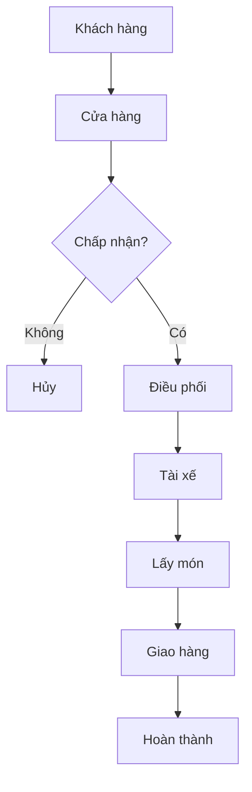

# Food Delivery Platform Development Proposal

## 1. Executive Summary
Mục tiêu là xây dựng nền tảng giao đồ ăn gồm App Khách hàng, App Cửa hàng, App Tài xế và Web Admin nhằm số hóa quy trình đặt món, điều phối và quản lý.

## 2. Business Objectives
- Tự động hóa quy trình đặt và giao hàng.
- Giảm thời gian điều phối.
- Theo dõi đơn hàng realtime.
- Dễ mở rộng.

## 3. Project Scope
### Bao gồm
- App Khách
- App Cửa hàng
- App Tài xế
- Web Admin
- Backend API
- PostgreSQL + PostGIS
- Google Maps
- Push Notification
- Realtime GPS

### Không bao gồm
- Thanh toán online
- Voucher
- Loyalty
- Chat
- Multi-order

## 4. Assumptions
- 1 cửa hàng = 1 địa chỉ
- 1 đơn = 1 cửa hàng
- 1 tài xế = 1 đơn
- COD
- Admin có thể assign tài xế

## 5. Luồng Nghiệp Vụ

## 6. Technology
- Mobile: SwiftUI/Kotlin hoặc Flutter
- Backend: NestJS
- Admin: Next.js
- Database: PostgreSQL + PostGIS
- Realtime: Socket.IO

## 7. Modules & Estimate
||Module|Days|
|---|---:|
|Analysis|5|
|Backend|15|
|Customer App|10|
|Restaurant App|15|
|Driver App|9|
|Admin|9|
|Dispatch|8|
|Realtime|6|
|Maps|4|
|Testing|10|
|Deploy|3|

## 8. Infrastructure Cost
- Initial: Apple Developer, Google Play, Domain.
- Monthly: VPS, Backup, Maps (~1–3 triệu VNĐ/tháng cho MVP).

## 9. Commercial
- MVP: 110–140 triệu VNĐ
- Warranty: 3 months
